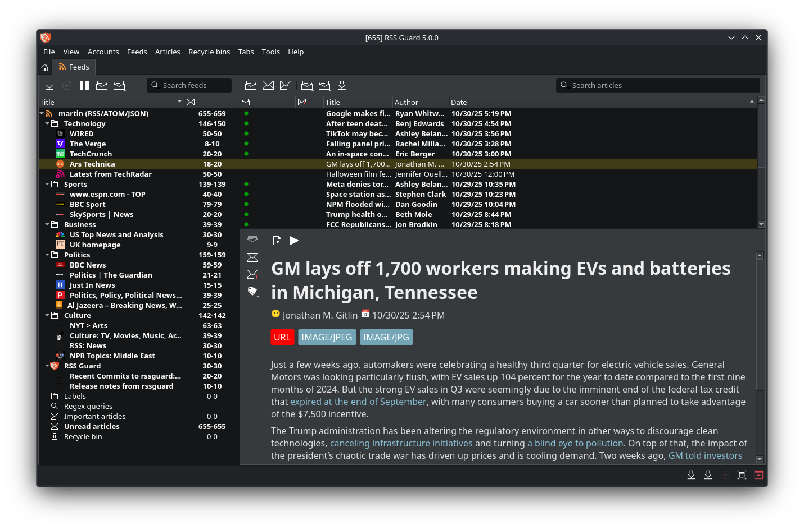

RSS Guard
=========

### [Discord server](https://discord.gg/7xbVMPPNqH) | [Downloads](https://github.com/martinrotter/rssguard/releases) | [Development builds](https://github.com/martinrotter/rssguard/releases/tag/devbuild) | [Documentation](https://rssguard.readthedocs.io) | [Translations](https://rssguard.readthedocs.io/en/stable/contrib/localization.html)

RSS Guard is a simple RSS/ATOM feed reader for Windows, Linux, BSD, OS/2 or macOS which can work with RSS/ATOM/JSON/iCalendar/Sitemap feeds as well as many online feed services:
* [Feedly](https://feedly.com)
* [Gmail](https://developers.google.com/gmail/api)
* Google Reader API ([Bazqux](https://bazqux.com), [FreshRSS](https://freshrss.org), [Inoreader](https://www.inoreader.com), [Miniflux](https://miniflux.app), [Reedah](http://reedah.com), [The Old Reader](https://theoldreader.com) and more)
* [Nextcloud News](https://apps.nextcloud.com/apps/news)
* [Tiny Tiny RSS](https://tt-rss.org)

RSS Guard is also podcast player as it can play everything via its built-in `mpv`-based (or `ffmpeg`-based) media player.

Also, RSS Guard has built-in support for [Gemini](https://geminiprotocol.net) protocol and hypertext format, so it can very well act as reliable cross-platform Gemini client!

## Contributing to RSS Guard
To start contributing to RSS Guard, please read [CONTRIBUTING.md](CONTRIBUTING.md). Any contributions are appreciated.

## Thank you!
Contributed graphics:
* RSS Guard logo - [Siddharth Yadav](mailto:illustrationdesignsid@gmail.com), [@Siddharth_yd](https://www.instagram.com/siddharth_yd/)
* Flag icons - [IconDrawer](http://www.icondrawer.com)
