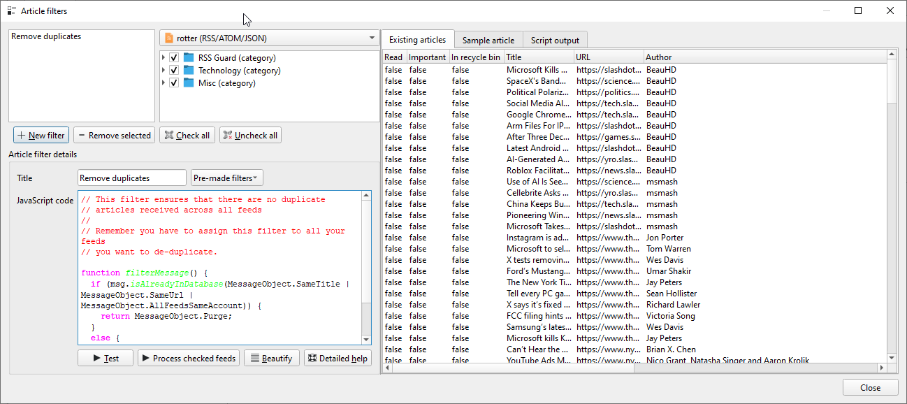

Article Filtering
=================
Sometimes you need to automatically tweak the incoming article - mark it starred, remove ads from its contents or simply reject it. That's where article filtering feature comes in.

## `Article filters` dialog
The dialog seen below offers you a way of managing your article filters. You can assign single filter to multiple feeds across all accounts. Dialog allows you to test existing filters and see what changes have been done to articles during filtering process.

`Test` button tests selected filter against existing messages without making permanent changes to them. `Process checked feeds` runs the filter against existing messages from checked feeds - in this mode all modifications made by the filter are saved to existing messages.



## Writing article filter
Article filters are small scripts which are executed automatically when articles/feeds are downloaded. Article filters are `JavaScript` snippets which must provide function with prototype:

```js
function filterMessage() { }
```

The function must return values which belong to enumeration [`FilteringAction`](#filteringaction-enum).

Supported set of built-in "standard library" adheres to [ECMA-262](https://ecma-international.org/publications-and-standards/standards/ecma-262).

Each article is accessible in your script via global variable/property named `msg`. Some properties are writeable, allowing you to change contents of the article before it is written to RSS Guard DB. You can mark article important, change its description, perhaps change author name or even assign some [label](labels) to it!!!

```{note}
Some attributes (`read/unread/starred` states) are synchronized back to your account's server - so you can for example mark some articles as starred and the change will be propagated back to TT-RSS server if you use TT-RSS.
```

```{attention}
A special [placeholders](userdata.md#data-placeholder) can be used in article filters.
```

## Global variables

There are many global variables which provide information which can be used when filtering and modifying articles. Here is the list:

| Global variable | What it provides
| :---            | :---
| `msg`           | Information about the actual article which is being filtered/modified.
| `feed`          | All information about the feed which the article belongs to.
| `acc`           | Account-related information.
| `app`           | Application-wide information, like RSS Guard version and so on.
| `utils`         | Bunch of useful functions you could find handy in your filtering scripts.
| `run`           | Information about current article filtering run. Contains number of so far accepted articles and so on.
| `fs`            | Filesystem-related actions like process launching, file operations and so on.

## Reference Documentation

Here is the complete reference documentation of all functions and properties available for your filtering scripts.

### `msg`

#### Properties

| Name               | Type                    | Read-only | Synchronized | Description
| :---               | :---                    | :---:     | :---:        | ---
| `assignedLabels`   | `Array<Label>`          | ✅         | ✅            | List of labels assigned to the article.
| `categories`       | `Array<MessageCategory>`| ✅         | ❌            | List of categories of the article (extracted from feed).
| `id`               | `Number`                | ✅         | ❌            | ID assigned to the message in RSS Guard local database.
| `customId`         | `String`                | ❌         | ❌            | ID of the message as provided by the remote service or feed file.
| `title`            | `String`                | ❌         | ❌            | The message title.
| `url`              | `String`                | ❌         | ❌            | The message URL.
| `author`           | `String`                | ❌         | ❌            | Author of the message.
| `contents`         | `String`                | ❌         | ❌            | Contents of the message.
| `rawContents`      | `String`                | ❌         | ❌            | This is the RAW contents of the message obtained from remote service/feed. A raw XML or JSON element data. This attribute has the value only if `runningFilterWhenFetching` returns `true`. In other words, this attribute is not persistently stored in the RSS Guard's DB. Also, this attribute is artificially filled in with ATOM-like data when testing the filter.
| `score`            | `Number`                | ❌         | ❌            | Arbitrary number in range \<0.0, 100.0\>. You can use this number to sort messages in a custom fashion as this attribute also has its own column in articles list.
| `hasEnclosures`    | `Boolean`               | ✅         | ❌            | Returns `true` if the article has at least one enclosure/attachment. Otherwise returns `false`.
| `created`          | `Date`                  | ❌         | ❌            | Date/time of the message.
| `createdIsMadeup`  | `Boolean`               | ✅         | ❌            | Is `true` if date/time of message was NOT fetched from the feed and current date/time was used instead. 
| `isRead`           | `Boolean`               | ❌         | ✅            | Is message read?
| `isImportant`      | `Boolean`               | ❌         | ✅            | Is message important?
| `isDeleted`        | `Boolean`               | ❌         | ❌            | Is message placed in recycle bin?

#### Functions

| Name(Parameters)                                                              | Return value | Description
| :---                                                                          | :---         | :---
| `addEnclosure(String url, String mime_type)`                                  | `void`       | Adds multimedia attachment to the article.
| `isAlreadyInDatabase(DuplicityCheck criteria)`                                | `Boolean`    | Allows you to check if SAME message is already stored in the RSS Guard's DB.
| `isAlreadyInDatabaseWinkler(DuplicityCheck criteria, Number threshold = 0.1)` | `Boolean`    | Allows you to check if SIMILAR message is already stored in the RSS Guard's DB using Jaro-Winkler edit distance algorithm.
| `assignLabel(String label_id)`                                                | `Boolean`    | Assigns label to the message. The `String` value is the `customId` property of `Label` type. See its API reference for relevant info.
| `deassignLabel(String label_id)`                                              | `Boolean`    | Removes label from the message. The `String` value is the `customId` property of `Label` type. See its API reference for relevant info.
| `deassignAllLabels()`                                                         | `void`       | Removes all labels from messages.
| `exportCategoriesToLabels(Boolean assign_to_message)`                         | `void`       | Creates RSS Guard labels for all categories of this message. Also optionally assigns the message to those labels.
| `addEnclosure(String url, String mime_type)`                                  | `void`       | Appends new enclosure/attachment with given URL and MIME type to the article.

### `app`

#### Functions

| Name(Parameters)                                | Return value | Description
| :---                                            | :---         | :---
| `log(String message)`                           | `void`       | Prints message to RSS Guard standard output and also to "Script output" box if "Article filters" dialog is displayed.
| `showNotification(String title, String text)`   | `void`       | Display toast desktop notification with given title and text.

### `run`

#### Properties

| Name                         | Type      | Read-only | Description
| :---                         | :---      | :---:     | :---
| `numberOfAcceptedMessages`   | `Number`  | ✅         | Number of so far accepted messages from this feed fetching run.
| `indexOfCurrentFilter`       | `Number`  | ✅         | Index of currently executing filter (starting from 0).
| `totalCountOfFilters`        | `Number`  | ✅         | Total number of filters which will execute.

### `acc`

#### Properties

| Name               | Type            | Read-only | Description
| :---               | :---            | :---:     | :---
| `id`               | `Number`        | ✅         | Database ID of an account.
| `title`            | `String`        | ✅         | Title of account.
| `availableLabels`  | `Array<Label>`  | ✅         | List of available labels which can be assigned to articles.

#### Functions

| Name(Parameters)                                          | Return value | Description
| :---                                                      | :---         | :---
| `findLabel(String label_title)`                           | `String`       | Finds label with given title. Returns label ID.
| `createLabel(String label_title, String hex_color_code)`  | `String`       | Creates label with given title and color. Returns label ID.

### `feed`

#### Properties

| Name               | Type            | Read-only | Description
| :---               | :---            | :---:     | :---
| `customId`         | `String`        | ✅         | Custom ID of the feed.
| `title`            | `String`        | ✅         | Title of the feed.

### `utils`

#### Properties

| Name               | Type            | Read-only | Description
| :---               | :---            | :---:     | :---
| `hostname`         | `String`        | ✅         | Name of your PC.

#### Functions

| Name(Parameter)                                             | Return value  | Description
| :---                                                        | :---          | :---
| `fromXmlToJson(String xml_string)`                          | `String`      | Converts XML string into JSON.
| `parseDateTime(String date_time)`                           | `Date`        | Converts textual date/time representation into proper `Date` object.

### `fs`

#### Functions

| Name(Parameter)                                                                | Return value  | Description
| :---                                                                           | :---          | :---
| `runExecutable(String exec, Array<String> params, String stdin_data)`          | `void`        | Launches external executable with optional parameters and does not wait until executable finishes. Also allows passing data to standard input.
| `runExecutableGetOutput(String exec, Array<String> params, String stdin_data)` | `String`      | Launches external executable with optional parameters, reads its standard output, and returns the output when executable finishes. Also allows passing data to standard input.

### Shared Data Types

#### `FilteringAction` enum

| Enumerant name    | Integer value | Description
| :---              | :---          | ---
| `Accept`          | 1             | Message is accepted and will be added or updated in DB.
| `Ignore`          | 2             | Message is ignored and will **NOT** be added or updated in DB. Already existing message will not be purged from DB.
| `Purge`           | 4             | Existing message is purged from the DB completely. Behaves like `Ignore` when there is a new incoming message.


#### `DuplicityCheck` enum

| Enumerant name        | Integer value | Description
| :---                  | :---          | ---
| `SameTitle`           | 1             | Check if message has same title as some another messages.
| `SameUrl`             | 2             | Check if message has same URL as some another messages.
| `SameAuthor`          | 4             | Check if message has same author as some another messages.
| `SameDateCreated`     | 8             | Check if message has same date of creation as some another messages.
| `AllFeedsSameAccount` | 16            | Perform the check across all feeds from your account, not just "current" feed.
| `SameCustomId`        | 32            | Check if message with same custom ID exists in RSS Guard DB.

#### `MessageCategory`

##### Properties

| Name      | Type      | Read-only | Description
| :---      | :---      | :---:     | ---
| `title`   | `String`  | ✅         | Title of the message category.

#### `Label`

##### Properties

| Name          | Type      | Read-only | Description
| :---          | :---      | :---:     | ---
| `title`       | `String`  | ✅         | Label name.
| `customId`    | `String`  | ✅         | Service-specific ID of the label. The ID is used as a unique identifier for label. It is useful if you want to assign/unassign the message label.
| `color`       | `Color`   | ✅         | Label color. See the type `color` documentation in [Qt docs](https://doc.qt.io/qt-6/qml-color.html).

```{attention}
The `msg` attributes are synchronized with service even if you return `Purge` or `Ignore`. In other words, even if the filter ignores the article, you can still tweak its properties, and they will be synchronized back to your server.
```

## Examples

```js
/*
 * Accept whitelisted articles based on regular expression filtering.
 */
function filterMessage() {
  // List of regular expressions.
  const whitelist = [
    /ubuntu.+desktop/i,
    /linux.+app/i,
    /\d.billion/i];

  // Accept article if it meets at least one of those regular expressions.
  if (whitelist.some(re => re.test(msg.title))) {
    return Msg.Accept;
  }

  return Msg.Ignore;
}
```

```js
/*
 * Mark all whitelisted messages as important. 
 */
function filterMessage() {
  const whitelist = [
    /stock/i,
    /crypto/i,
    /market/i];

  if (whitelist.some(re => re.test(msg.title))) {
    msg.isImportant = true;
  }

  return Msg.Accept;
}
```

```js
/*
 * Ignore incoming articles which have very SIMILAR (not same) URL
 * as some article stored in database.
 * 
 * Use very high similarity factor 0.05 which ensures that only highly
 * similar URLs are considered "same".
 * 
 * This effectively filters out all incoming articles which are very similar
 * to the articles we already have.
 */ 
function filterMessage() {
  if (msg.isAlreadyInDatabaseWinkler(Msg.SameUrl, 0.05)) {
    return Msg.Ignore;
  }

  return Msg.Accept;
}
```

```js
/*
 * Ignore articles which are older than 7 days.
 *
 * Note that there already is built-in functionality for this date-based filtering
 * but if you want to use article filter for it, then this is the way.
 */
function filterMessage() {
  let now = new Date();
  let age = (now - msg.created) / (1000 * 60 * 60 * 24);

  if (age > 7) {
    return Msg.Ignore;
  }

  return Msg.Accept;
}
```

```js
/*
 * Assign label "AI" to all articles matching at least one whitelist condition.
 *
 * Make sure to have label "AI" created beforehand.
 */
function filterMessage() {
  if (/AI|robot|software|hardware/i.test(msg.title)) {
    let id = acc.findLabel("AI");

    if (id) {
      msg.assignLabel(id);
    }
  }

  return Msg.Accept;
}
```

```js
/*
 * Display desktop notification when totally new breaking news are incoming.
 */
function filterMessage() {
  if (/breaking/i.test(msg.title) && !msg.isAlreadyInDatabaseWinkler(Msg.SameTitle, 0.05)) {
    app.showNotification("Breaking News", msg.title);
    msg.isImportant = true;
  }

  return Msg.Accept;
}
```

```js
/*
 * Automatically create RSS Guard labels for all article categories defined for this article in a feed source.
 * 
 * This supports RSS, ATOM and JSON category standards.
 */
function filterMessage() {
  msg.exportCategoriesToLabels(true);
  return Msg.Accept;
}
```

```js
/*
 * If the article link points to YouTube video, then add it as article attachment/enclosure.
 */
function filterMessage() {
  if (/youtube\.com/.test(msg.url)) {
    msg.addEnclosure(msg.url, "video/mp4");
  }

  return Msg.Accept;
}
```

```js
/*
 * Converts HTML article contents to pure plain text, removing all HTML formatting. It also
 * converts all hyperlinks to plain text.
 */
function filterMessage() {
  let text = msg.contents;

  // Convert links: <a href="URL">Text</a> → Text (URL).
  text = text.replace(
      /<a[^>]+href="([^"]+)"[^>]*>(.*?)<\/a>/gi, (m, url, label) => {
        return label + ' (' + url + ')';
      });

  // Remove all other HTML tags.
  text = text.replace(/<[^>]*>/g, '');

  // Extended HTML entities dictionary.
  const entities = {
    '&amp;': '&',
    '&lt;': '<',
    '&gt;': '>',
    '&quot;': '"',
    '&#39;': '\'',
    '&nbsp;': ' ',
    '&copy;': '©',
    '&reg;': '®',
    '&euro;': '€',
    '&pound;': '£',
    '&yen;': '¥',
    '&cent;': '¢',
    '&sect;': '§',
    '&para;': '¶',
    '&bull;': '•',
    '&ndash;': '–',
    '&mdash;': '—',
    '&lsquo;': '‘',
    '&rsquo;': '’',
    '&ldquo;': '“',
    '&rdquo;': '”',
    '&hellip;': '…',
    '&trade;': '™',
    '&deg;': '°',
    '&plusmn;': '±',
    '&times;': '×',
    '&divide;': '÷'
  };

  // Replace entities with plain text.
  text = text.replace(/&[a-z#0-9]+;/gi, (entity) => entities[entity] || entity);

  // Normalize whitespace.
  text = text.replace(/\s+/g, ' ').trim();

  msg.contents = text;

  return Msg.Accept;
}
```

```js
/*
 * Convert article contents from HTML to plain text with Pandoc.
 *
 * This uses Pandoc binary placed directly in user data folder.
 * Article contents are passed to Pandoc via standard input.
 */
function filterMessage() {
  let res = fs.runExecutableGetOutput(
      '%data%\\pandoc.exe',
      ['-f', 'html', '-t', 'plain'],
      msg.contents);

  msg.contents = res;

  return Msg.Accept;
}
```

```js
/*
 * Embed all images directly into the article, so that article fully works when being offline.
 *
 * This calls external Python script (see below) which examines article contents, downloads all images
 * and stores their data directly into the article.
 * 
 * Note that this script is fairly slow, you should pair it with "acc.isAlreadyInDatabase()" function
 * and is it sparingly as the RSS Guard database will grow immensely.
 */
function filterMessage() {
  let res = fs.runExecutableGetOutput(
      'python3.exe', ['%data%\\img2base.py'], msg.contents);

  msg.contents = res;

  return Msg.Accept;
}
```

```python
# img2base.py
import sys, io, base64, requests, mimetypes
from bs4 import BeautifulSoup

sys.stdin = io.TextIOWrapper(sys.stdin.buffer, encoding="utf-8")
sys.stdout = io.TextIOWrapper(sys.stdout.buffer, encoding="utf-8")

soup = BeautifulSoup(sys.stdin.read(), "html.parser")

for img in soup.find_all("img"):
    src = img.get("src")
    if src and src.startswith(("http://", "https://")):
        try:
            r = requests.get(src, timeout=10)
            r.raise_for_status()
            mime, _ = mimetypes.guess_type(src)
            if not mime:
                mime = "application/octet-stream"
            b64 = base64.b64encode(r.content).decode("utf-8")
            img["src"] = f"data:{mime};base64,{b64}"
        except:
            continue

sys.stdout.write(str(soup))
```

```js
/*
 * Translate article title using external Python script (see below) and also print it to "Script output" dialog.
 *
 * Python sometimes adds extra newlines at the end of its standard output, so trim the translated
 * title to make sure it is all nice and clean.
 * 
 * Note that the translation script calls remote service to do the translating so it is NOT fast. Use sparingly.
 */
function filterMessage() {
  msg.title = fs.runExecutableGetOutput("python3.exe", ["trans-stdin.py", "en", "cs"], msg.title);

  msg.title = msg.title.trim();
  app.log(msg.title);

  return Msg.Accept;
}
```

```python
import sys
import asyncio
from googletrans import Translator

async def translate_string(to_translate, lang_src, lang_dest):
    async with Translator() as translator:
        translated_text = await translator.translate(to_translate, src=lang_src, dest=lang_dest)
        print(translated_text.text)

lang_from = sys.argv[1]
lang_to = sys.argv[2]

sys.stdin.reconfigure(encoding="utf-8")
sys.stdout.reconfigure(encoding="utf-8")

data = sys.stdin.read()

asyncio.run(translate_string(data, lang_from, lang_to))
```