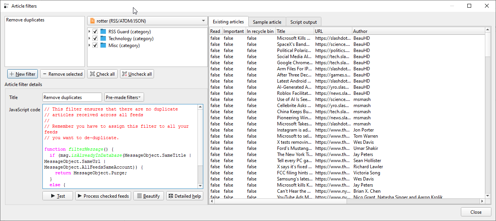

Article Filtering
=================
Sometimes you need to automatically tweak an incoming article, mark it as important, remove ads from its contents, or simply reject it. That is where the article-filtering feature comes in.

Article filters are meant for advanced users. They are powerful, but they can slow down feed updates, fetch extra data, launch external tools, or make changes that are synchronized back to some online services.

## `Article filters` dialog
The dialog shown below lets you:
* create, remove, enable, disable, and reorder filters
* assign a filter to multiple feeds within the selected account
* test a filter on already stored articles
* run a filter on checked feeds and save the accepted changes back to the database



Filters run in ascending sort order. Only enabled filters are executed.

The right-hand side of the dialog has two main uses:
* `Test`
  Runs the selected filter against the currently loaded existing articles without permanently saving any changes.
* `Process checked feeds`
  Runs the selected filter on undeleted articles from all checked feeds and writes accepted changes back to the database.

The `Existing articles` table is especially useful during testing:
* `Result` shows whether a message was accepted, ignored, or purged
* changed values in columns like `Read`, `Important`, `Trash`, `Title`, `Date`, and `Score` are highlighted
* tooltips show the original value and the filtered value
* the lower detail tabs let you inspect article metadata and contents

The `Script output` tab shows messages written by `app.log(...)`, and also shows script errors when testing from the dialog.

```{warning}
During normal feed fetching, a JavaScript error in a filter does **not** reject the article. RSS Guard logs the error and continues as if the message was accepted. In the testing dialog, the error is shown to you directly.
```

```{warning}
Feed-level article ignoring and article-count limits run **after** article filters. So even if your filter accepts an article, a later cleanup or ignore rule may still prevent it from being kept.
```

## How filters are applied
Each enabled filter is run on each article in order.

For newly downloaded articles:
* `Accept`
  Keeps the article and continues to the next filter.
* `Ignore`
  Drops the article from this fetch run. Later filters do not run for that article.
* `Purge`
  Behaves like `Ignore` for a newly downloaded article.

For existing articles processed from the dialog:
* `Accept`
  Keeps the article and saves its changed fields.
* `Ignore`
  Skips saving changes for that article.
* `Purge`
  Permanently removes the article from the database.

This means `Ignore` and `Purge` are very different when you run a filter on already stored messages.

## Writing an article filter
Article filters are small `JavaScript` snippets. Each script must provide a function with this prototype:

```js
function filterMessage() { }
```

The function must return one of the values from the [`FilteringAction`](#filteringaction-enum) enumeration.

The built-in JavaScript environment is based on Qt's `QJSEngine` and includes a useful set of helper objects exposed by RSS Guard.

Each article is available via the global `msg` object. Other globals provide access to the current feed, account, helper functions, run metadata, application logging, and process launching.

```{note}
Some attributes such as `read`, `unread`, and `starred` states are synchronized back to your account's server. So, for example, marking an article as important in a filter may trigger a matching state change on services that support it.
```

```{attention}
Special [placeholders](userdata.md#data-placeholder) can be used in article filters. This is especially useful for loading helper files, keyword lists, or calling external tools from your user-data folder.
```

## Power-user tips
* Keep filters cheap first, expensive filters later.
  A fast duplicate or keyword check near the top can save time before you do heavier work like full-content extraction.
* Prefer returning early.
  If a message should obviously be ignored, do that early and skip unnecessary processing.
* Use `Test` before `Process checked feeds`.
  This makes it much easier to catch a bad regular expression or an accidental `Purge`.
* Use `app.log(...)` while developing.
  It is much easier to debug a filter when it prints intermediate values into the `Script output` tab.
* Be careful with `fetchFullContents(...)`.
  It may issue extra network requests, slow down updates, and substantially increase database size.
* Be careful with external executables.
  They can be extremely useful, but they can also be slow or platform-specific.

## Global variables

These global objects are available to your scripts:

| Global variable | What it provides |
| :---            | :--- |
| `msg`           | Information about the actual article being filtered or modified. |
| `feed`          | Information about the feed the article belongs to. |
| `acc`           | Account-related information. |
| `app`           | Application-wide helper functions such as logging and notifications. |
| `utils`         | Utility functions for parsing data and reading or writing files. |
| `run`           | Information about the current filtering run. |
| `fs`            | Process-launching helpers for calling external executables. |

## Reference Documentation

Here is the complete reference documentation of the functions and properties available to your filtering scripts.

### `msg`

#### Properties

| Name               | Type                      | Read-only | Synchronized | Description |
| :---               | :---                      | :---:     | :---:        | :--- |
| `assignedLabels`   | `Array<Label>`            | Yes       | Yes          | List of labels assigned to the article. |
| `categories`       | `Array<MessageCategory>`  | Yes       | No           | List of categories of the article, extracted from the feed. |
| `enclosures`       | `Array<MessageEnclosure>` | Yes       | No           | List of attachments of the article. |
| `id`               | `Number`                  | Yes       | No           | ID assigned to the message in the local RSS Guard database. |
| `customId`         | `String`                  | No        | No           | ID of the message as provided by the remote service or feed file. |
| `title`            | `String`                  | No        | No           | The message title. |
| `url`              | `String`                  | No        | No           | The message URL. |
| `author`           | `String`                  | No        | No           | Author of the message. |
| `contents`         | `String`                  | No        | No           | Contents of the message. |
| `rawContents`      | `String`                  | No        | No           | Raw contents obtained from the remote service or feed. This is usually raw XML or JSON. It is normally useful only for newly fetched articles, not when testing existing ones from the dialog. |
| `score`            | `Number`                  | No        | No           | Arbitrary number in the range \<0.0, 100.0\>. Useful for custom ranking and sorting. |
| `hasEnclosures`    | `Boolean`                 | Yes       | No           | Returns `true` if the article has at least one enclosure or attachment. |
| `created`          | `Date`                    | No        | No           | Date and time of the message. |
| `createdIsMadeup`  | `Boolean`                 | Yes       | No           | Is `true` if the message timestamp was synthesized instead of taken from the source feed. |
| `isRead`           | `Boolean`                 | No        | Yes          | Is the message read? |
| `isImportant`      | `Boolean`                 | No        | Yes          | Is the message important? |
| `isDeleted`        | `Boolean`                 | No        | No           | Is the message placed in the recycle bin? |

#### Functions

| Name(Parameters)                                                              | Return value | Description |
| :---                                                                          | :---         | :--- |
| `addEnclosure(String url, String mime_type)`                                  | `void`       | Adds a multimedia attachment to the article. |
| `removeEnclosure(int index)`                                                  | `Boolean`    | Removes one enclosure from the article according to the index, starting from zero. |
| `removeAllEnclosures()`                                                       | `void`       | Removes all enclosures from the article. |
| `fetchFullContents(Boolean plain_text_only)`                                  | `Boolean`    | Fetches fuller article contents for the article, in plain text or HTML form. [^1] |
| `isAlreadyInDatabase(DuplicityCheck criteria)`                                | `Boolean`    | Checks if a matching message is already stored in the database. |
| `isAlreadyInDatabaseWinkler(DuplicityCheck criteria, Number threshold = 0.1)` | `Boolean`    | Checks if a similar message is already stored in the database by using Jaro-Winkler similarity. |
| `assignLabel(String label_id)`                                                | `Boolean`    | Assigns a label to the message. The `String` value is the `customId` property of the `Label` type. |
| `deassignLabel(String label_id)`                                              | `Boolean`    | Removes a label from the message. The `String` value is the `customId` property of the `Label` type. |
| `deassignAllLabels()`                                                         | `void`       | Removes all labels from the message. |
| `exportCategoriesToLabels(Boolean assign_to_message)`                         | `void`       | Creates RSS Guard labels for all categories of this message and can optionally assign them to the article. [^2] |

[^1]: Fetching fuller contents may issue extra network requests, can slow down feed fetching, and can increase database size significantly.
[^2]: This is intended mainly for newly fetched articles. When processing already stored articles from the dialog, this helper may not have anything useful to export.

### `app`

#### Functions

| Name(Parameters)                              | Return value | Description |
| :---                                          | :---         | :--- |
| `log(String message)`                         | `void`       | Prints a message to RSS Guard's log and to the `Script output` box in the dialog. |
| `showNotification(String title, String text)` | `void`       | Displays a desktop notification with the given title and text. |

### `run`

#### Properties

| Name                       | Type     | Read-only | Description |
| :---                       | :---     | :---:     | :--- |
| `numberOfAcceptedMessages` | `Number` | Yes       | Number of messages accepted so far in the current filtering run. |
| `indexOfCurrentFilter`     | `Number` | Yes       | Zero-based index of the currently executing filter. |
| `totalCountOfFilters`      | `Number` | Yes       | Total number of filters that will execute in the current run. |

### `acc`

#### Properties

| Name              | Type           | Read-only | Description |
| :---              | :---           | :---:     | :--- |
| `id`              | `Number`       | Yes       | Database ID of the account. |
| `title`           | `String`       | Yes       | Title of the account. |
| `availableLabels` | `Array<Label>` | Yes       | List of labels currently available for assignment. |

#### Functions

| Name(Parameters)                                         | Return value | Description |
| :---                                                     | :---         | :--- |
| `findLabel(String label_title)`                          | `String`     | Finds a label with the given title. Returns the label ID or an empty string. |
| `createLabel(String label_title, String hex_color_code)` | `String`     | Creates a label with the given title and color and returns the label ID. If the label already exists, its existing ID is returned. |

### `feed`

#### Properties

| Name       | Type     | Read-only | Description |
| :---       | :---     | :---:     | :--- |
| `customId` | `String` | Yes       | Custom ID of the feed. |
| `title`    | `String` | Yes       | Title of the feed. |

### `utils`

#### Properties

| Name       | Type     | Read-only | Description |
| :---       | :---     | :---:     | :--- |
| `hostname` | `String` | Yes       | Name of your local machine. |

#### Functions

| Name(Parameter)                                | Return value  | Description |
| :---                                           | :---          | :--- |
| `fromXmlToJson(String xml_string)`             | `String`      | Converts an XML string into JSON. |
| `readFile(String filename)`                    | `ArrayBuffer` | Reads a file into a byte array. |
| `writeFile(String filename, ArrayBuffer data)` | `void`        | Writes a byte array to a file. |
| `readTextFile(String filename)`                | `String`      | Reads a text file as UTF-8. |
| `writeTextFile(String filename, String text)`  | `void`        | Writes text as UTF-8. |
| `parseDateTime(String date_time)`              | `Date`        | Converts a textual date/time representation into a proper `Date` object. |

### `fs`

#### Functions

| Name(Parameter)                                                                | Return value  | Description |
| :---                                                                           | :---          | :--- |
| `runExecutable(String exec, Array<String> params, String stdin_data)`          | `void`        | Launches an external executable with optional parameters and optional standard input, without waiting for it to finish. |
| `runExecutableGetOutput(String exec, Array<String> params, String stdin_data)` | `String`      | Launches an external executable, waits for it to finish, and returns its standard output as text. |

```{warning}
External processes launched through `fs` use the RSS Guard user-data folder as the default working directory unless you explicitly pass another one.
```

### Shared Data Types

#### `FilteringAction` enum

| Enumerant name | Integer value | Description |
| :---           | :---          | :--- |
| `Accept`       | 1             | Message is accepted and will be added or updated in the DB. |
| `Ignore`       | 2             | Message is ignored and will **NOT** be added or updated in the DB. An already existing message will not be purged from the DB. |
| `Purge`        | 4             | An existing message is purged from the DB completely. Behaves like `Ignore` when there is a new incoming message. |

#### `DuplicityCheck` enum

| Enumerant name        | Integer value | Description |
| :---                  | :---          | :--- |
| `SameTitle`           | 1             | Check if the message has the same title as another message. |
| `SameUrl`             | 2             | Check if the message has the same URL as another message. |
| `SameAuthor`          | 4             | Check if the message has the same author as another message. |
| `SameDateCreated`     | 8             | Check if the message has the same creation date as another message. |
| `AllFeedsSameAccount` | 16            | Perform the check across all feeds in the account, not just the current feed. |
| `SameCustomId`        | 32            | Check if a message with the same custom ID exists in the RSS Guard DB. |

#### `MessageEnclosure`

##### Properties

| Name       | Type     | Read-only | Description |
| :---       | :---     | :---:     | :--- |
| `url`      | `String` | Yes       | URL of the message enclosure. |
| `mimeType` | `String` | Yes       | MIME type of the message enclosure. |

#### `MessageCategory`

##### Properties

| Name    | Type     | Read-only | Description |
| :---    | :---     | :---:     | :--- |
| `title` | `String` | Yes       | Title of the message category. |

#### `Label`

##### Properties

| Name       | Type     | Read-only | Description |
| :---       | :---     | :---:     | :--- |
| `title`    | `String` | Yes       | Label name. |
| `customId` | `String` | Yes       | Service-specific ID of the label. Useful when assigning or removing labels from messages. |

```{attention}
The `msg` attributes are synchronized with the service even if you return `Purge` or `Ignore`. In other words, even if the filter ignores the article, you can still tweak its synchronized properties and those changes may still be pushed back to the service.
```

## Examples

```js
/*
 * Accept whitelisted articles based on regular-expression filtering.
 */
function filterMessage() {
  const whitelist = [
    /ubuntu.+desktop/i,
    /linux.+app/i,
    /\d.billion/i
  ];

  if (whitelist.some(re => re.test(msg.title))) {
    return Msg.Accept;
  }

  return Msg.Ignore;
}
```

```js
/*
 * Mark matching articles as important and raise their score.
 */
function filterMessage() {
  if (/stock|crypto|market/i.test(msg.title)) {
    msg.isImportant = true;
    msg.score = 80;
  }

  return Msg.Accept;
}
```

```js
/*
 * Skip likely duplicates by comparing title similarity.
 */
function filterMessage() {
  if (msg.isAlreadyInDatabaseWinkler(Msg.SameTitle, 0.05)) {
    return Msg.Ignore;
  }

  return Msg.Accept;
}
```

```js
/*
 * Fetch fuller contents only for articles that seem new enough to keep.
 */
function filterMessage() {
  if (!msg.isAlreadyInDatabase(Msg.SameCustomId | Msg.AllFeedsSameAccount)) {
    msg.fetchFullContents(false);
  }

  return Msg.Accept;
}
```

```js
/*
 * Ignore articles older than 7 days.
 */
function filterMessage() {
  let now = new Date();
  let age = (now - msg.created) / (1000 * 60 * 60 * 24);

  if (age > 7) {
    return Msg.Ignore;
  }

  return Msg.Accept;
}
```

```js
/*
 * Assign label "AI" to matching articles.
 * Make sure the label already exists.
 */
function filterMessage() {
  if (/AI|robot|software|hardware/i.test(msg.title)) {
    let id = acc.findLabel("AI");

    if (id) {
      msg.assignLabel(id);
    }
  }

  return Msg.Accept;
}
```

```js
/*
 * Create labels automatically from message categories.
 */
function filterMessage() {
  msg.exportCategoriesToLabels(true);
  return Msg.Accept;
}
```

```js
/*
 * Show a desktop notification only for apparently new breaking news.
 */
function filterMessage() {
  if (/breaking/i.test(msg.title) &&
      !msg.isAlreadyInDatabaseWinkler(Msg.SameTitle, 0.05)) {
    app.showNotification("Breaking News", msg.title);
    msg.isImportant = true;
  }

  return Msg.Accept;
}
```

```js
/*
 * Turn the first enclosure into the main article URL.
 */
function filterMessage() {
  if (msg.enclosures.length > 0) {
    msg.url = msg.enclosures[0].url;
    msg.removeEnclosure(0);
  }

  return Msg.Accept;
}
```

```js
/*
 * Use a keyword file from the user-data folder to assign a score.
 *
 * Each line should be:
 *   keyword,score
 */
function filterMessage() {
  let keywords = [];

  try {
    let fileContent = utils.readTextFile('%data%/keywords.txt');
    keywords = fileContent
      .split(/\r?\n/)
      .map(line => {
        let parts = line.split(',');
        if (parts.length === 2) {
          return { term: parts[0].trim(), score: Number(parts[1].trim()) };
        }
        return null;
      })
      .filter(k => k && !isNaN(k.score));
  } catch (e) {
    app.log('Keywords file missing -> default score 0.');
    msg.score = 0;
    return Msg.Accept;
  }

  let totalScore = 0;

  for (let k of keywords) {
    let re = new RegExp(k.term, 'i');
    if (re.test(msg.title) || re.test(msg.contents)) {
      totalScore += k.score;
    }
  }

  msg.score = Math.min(totalScore, 100);

  if (msg.score >= 70) {
    msg.isImportant = true;
  }

  return Msg.Accept;
}
```

```js
/*
 * Keep a whitelist in an external text file.
 */
function filterMessage() {
  let keywords = [];

  try {
    let fileContent = utils.readTextFile('%data%\\whitelist.txt');
    keywords = fileContent.split(/\r?\n/).filter(line => line.trim() !== '');
  } catch (e) {
    app.log('No whitelist file found, accepting all articles.');
    return Msg.Accept;
  }

  for (let k of keywords) {
    let re = new RegExp(k, 'i');
    if (re.test(msg.title) || re.test(msg.contents)) {
      msg.isImportant = true;
      return Msg.Accept;
    }
  }

  return Msg.Ignore;
}
```

```js
/*
 * Convert HTML article contents to plain text.
 */
function filterMessage() {
  let text = msg.contents;

  text = text.replace(
      /<a[^>]+href="([^"]+)"[^>]*>(.*?)<\/a>/gi, (m, url, label) => {
        return label + ' (' + url + ')';
      });

  text = text.replace(/<[^>]*>/g, '');
  text = text.replace(/\s+/g, ' ').trim();

  msg.contents = text;

  return Msg.Accept;
}
```

```js
/*
 * Convert article contents from HTML to plain text with Pandoc.
 *
 * This uses a Pandoc binary placed directly in the user-data folder.
 */
function filterMessage() {
  let res = fs.runExecutableGetOutput(
      '%data%\\pandoc.exe',
      ['-f', 'html', '-t', 'plain'],
      msg.contents);

  msg.contents = res;

  return Msg.Accept;
}
```

```js
/*
 * Parse raw XML and log one field while debugging.
 */
function filterMessage() {
  if (msg.rawContents) {
    let rawJson = utils.fromXmlToJson(msg.rawContents);
    app.log(rawJson);
  }

  return Msg.Accept;
}
```

```js
/*
 * Raise the score for articles published on weekends.
 */
function filterMessage() {
  let day = msg.created.getDay(); // 0 = Sunday, 6 = Saturday

  if (day === 0 || day === 6) {
    msg.score = Math.min(msg.score + 15, 100);
  }

  return Msg.Accept;
}
```
