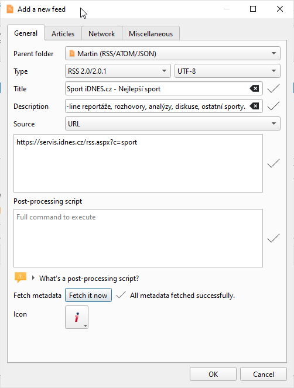

General GUI Concepts & Manipulating Accounts & Adding Feeds
===========================================================
* Feed list displays all your feeds and other items such as recycle bin.
* Article list displays all your articles depending on what is selected in feed list.
* Article preview displays details of selected article or information about selected item from feed list if no article is selected.
* Titlebar of RSS Guard display number of unread articles in square brackets.
* There are two toolbars available, separate toolbar for feed list and for article list.

----
When you start RSS Guard for the very first time, you are greeted with `Add account` dialog where you select which account you want to operate with. If you want to have classic `RSS/ATOM` feed reader, then select `RSS/RDF/ATOM/JSON` option.

Each "account" offers account-specific actions which are accessible in relevant submenu.

To add new feed into the account you simply use `Feeds -> Add item -> Add a new feed` menu item.

In 99% of cases, you only need to insert feed URL into `Source` field and then hit `Fetch it now` button which will download feed metadata and fill all other boxes.