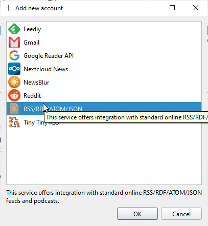
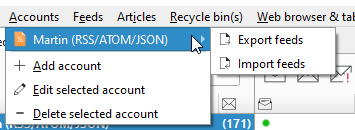
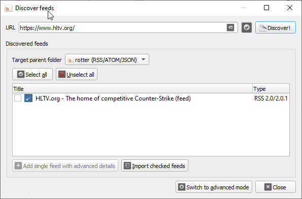
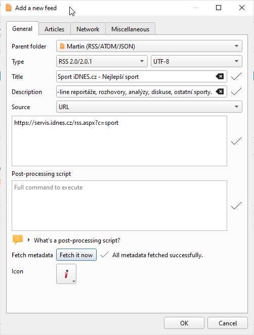

General GUI Concepts & Manipulating Accounts & Adding Feeds
===========================================================
* The feed list displays all your feeds and other items such as the recycle bin.
* The article list displays all your articles depending on what is selected in the feed list.
* The article preview displays details of the selected article or information about the selected item from the feed list if no article is selected.
* The same embedded viewer is also used for built-in web browsing. Depending on the package you installed, RSS Guard uses either the `web` viewer based on Qt WebEngine or the lighter `text` viewer based on QTextBrowser.
* The title bar of RSS Guard displays the number of unread articles in square brackets.
* There are two toolbars available: a separate toolbar for the feed list and another for the article list.

```{note}
Package names contain `web` or `text` to show which article/web viewer is included. The `web` viewer is more browser-like and feature-complete. The `text` viewer is lighter, but some browser actions and complex page rendering features are not available. See more [here](article-display).
```

----
When you start RSS Guard for the very first time, you are greeted with the `Add account` dialog, where you select which account you want to use. If you want a classic `RSS/ATOM` feed reader, select the `RSS/RDF/ATOM/JSON` option.



Each "account" offers account-specific actions that are accessible in the relevant submenu.



To add a new feed to the account, simply use the `Feeds -> Add item -> Add a new feed` menu item. You do not need to know the direct URL of the feed file. It is enough to enter the URL of the website you are interested in, for example `https://www.hltv.org`, and RSS Guard will find all available feed sources.



You can also switch to a more advanced dialog for adding individual feeds.



In 99% of cases, you only need to enter the feed URL into the `Source` field and then click the `Fetch it now` button, which downloads the feed metadata and fills in all other fields.
