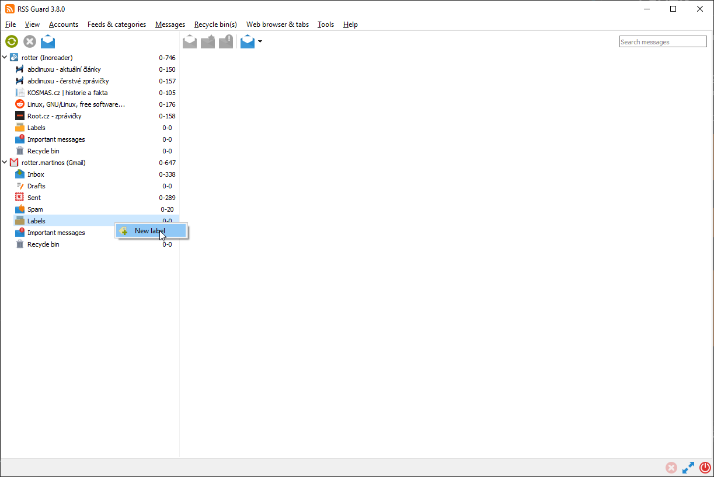
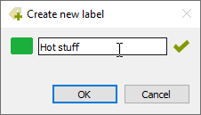
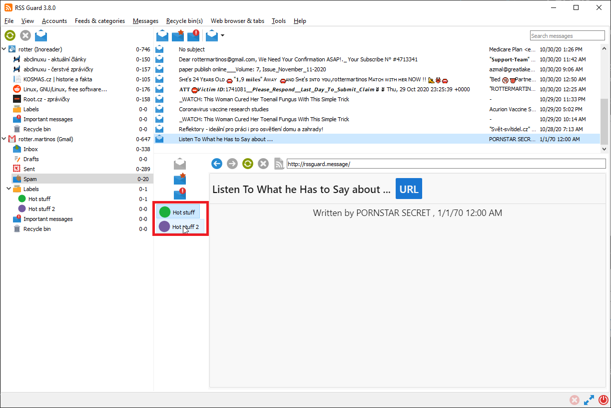

Labels
======
RSS Guard supports labels (tags). Any number of tags can be assigned to any article.

Note that tags in some plugins can be synchronized.

While labels are synchronized with these services, sometimes they cannot be created directly via RSS Guard. In this case, you have to create them via the web interface of the respective service and only then perform `Synchronize folders & other items`, which will fetch the newly created labels as well.

New labels can be added via the right-click menu of the `Labels` item in the feed list.

The title and color of a new label can also be chosen.

Unassigning a message label can be done easily through the message viewer.

Note that unassigning message labels is also synchronized at regular intervals with services that support label synchronization.

[Article filters](filters) can also assign or remove labels.
