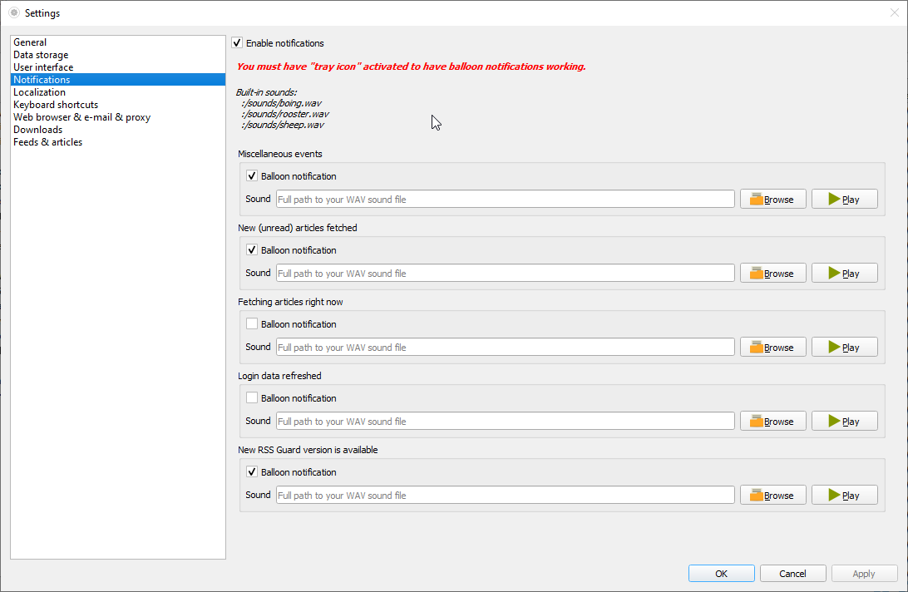

Notifications
=============
RSS Guard allows you to customize desktop notifications. There are a number of events which can be configured:
* New (unread) articles fetched
* Fetching of articles is started
* Login OAuth tokens are refreshed
* New RSS Guard version is available
* etc.

Your notification can also play `.wav` sounds which you can place under your user data folder and use them via special placeholder. Other audio formats are not supported.