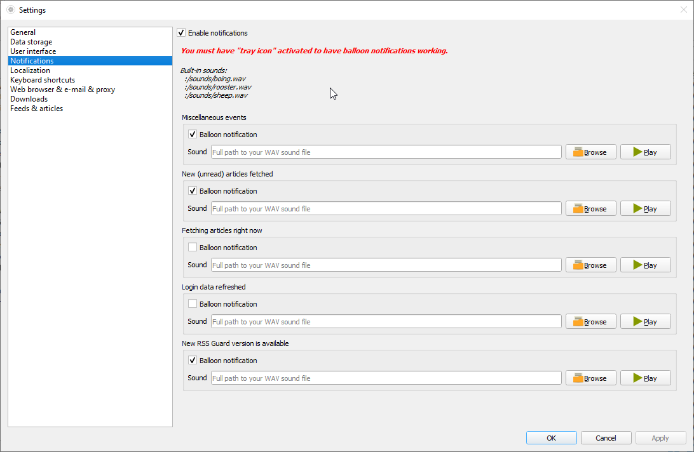

Notifications
=============
RSS Guard allows you to customize desktop notifications. There are a number of events that can be configured:
* New unread articles fetched
* Fetching of articles started
* OAuth login tokens refreshed
* A new RSS Guard version is available
* etc.

Your notifications can also play `.wav` sounds, which you can place in your [user data](userdata) folder and reference via a special [placeholder](userdata.md#data-placeholder). Other audio formats are not supported.
