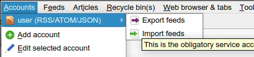

OPML file import
================
RSS Guard can import files in OPML format 

  
  
There is a specific window where you can specify an OPML file.

When RSS Guard imports the OPML file, it could take quite some time if there are many feeds because of online metadata fetching such as website favicon and website titles.

It is possible to specify specific category to import feeds to once they are loaded by RSS Guard.