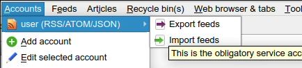
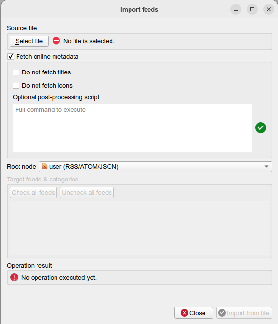

OPML File Import
================
RSS Guard can import files in OPML format.

There is a dedicated window where you can specify an OPML file.

When RSS Guard imports the OPML file, it may take quite some time if there are many feeds because online metadata such as website favicons and website titles is fetched as well.

It is possible to specify a category into which feeds should be imported once they are loaded by RSS Guard.
