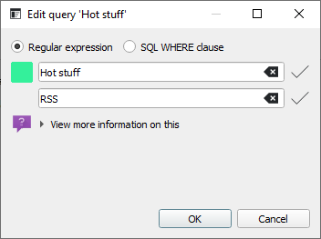

# Queries
The article list offers a search box to quickly filter displayed articles. If you want your search to remain persistent, you can create what we call a `Query`. You can right-click the `Queries` item in the feed list, and the following dialog will appear:



You can choose a name for your query and, more importantly, the actual search phrase. You need to enter either a valid [regular expression](https://learn.microsoft.com/en-us/dotnet/standard/base-types/regular-expression-language-quick-reference) or an SQL `WHERE` clause that is compatible with the `Messages` [table](https://github.com/martinrotter/rssguard/blob/master/resources/sql/db_init.sql).

Then confirm the dialog, and your search will appear in the feed list under the `Queries` item. If you click it, all matching articles will be shown.

```{attention}
The count of all, or unread, articles matching your query is disabled in the feed list for performance reasons. This limitation might be removed in the future.

Also, regular-expression filtering in the database is known to be relatively slow. So if you have many thousands of articles, regular-expression queries might be slower to load.
```
