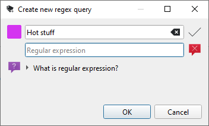

Regex Queries
=============
Article list offers search box to quickly filter displayed articles. If you want to have your search persistent forever, you can create what we call `Regex query`. You can right click `Regex queries` item in feed list and following dialog will show:

You can select name for your search and more importantly the actual search phrase. As the name of the feature suggests, you need to enter valid [regular expression](https://learn.microsoft.com/en-us/dotnet/standard/base-types/regular-expression-language-quick-reference).

Then you confirm the dialog and your search will show in feed list under `Regex queries` item. If you click it, all matching articles will be shown. Also, the article count shown next to the item is dynamically recalculated after new articles are fetched, so you can comfortably use this feature to track articles you are interested in.