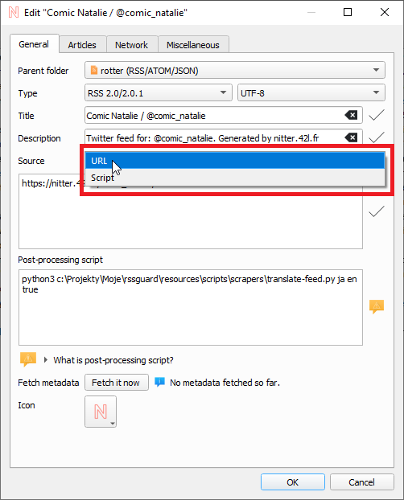
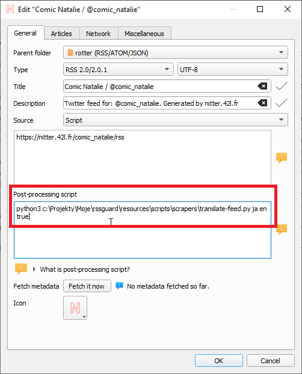

Scraping Websites
=================
```{warning}
Only proceed if you consider yourself a power user and you know what you are doing.
```

RSS Guard offers an additional advanced feature inspired by [Liferea](https://lzone.de/liferea).

The goal of this feature is to allow advanced users to use RSS Guard with data sources that do not provide a regular feed. You can use the feature to generate one.

----
You can select the type of source for each feed. Currently, these sources are supported:
* URL - RSS Guard simply downloads the feed file from the given location and behaves as expected.
* Local file - RSS Guard uses a file in the local filesystem as a feed source.
* Script - see below.

## `Script` option
If you choose the `Script` option, then you cannot provide the URL of your feed. Instead, you rely on a custom script to generate the feed file and provide its contents to [**standard output** (stdout)](https://en.wikipedia.org/wiki/Standard_streams#Standard_output_(stdout)). Data written to standard output should be valid feed data.

The `Fetch it now` button also works with the `Script` option. Therefore, if your source script and optional post-process script together deliver valid feed data to the output, then all important metadata, such as the title or icon of the feed, can be discovered automatically.



Any errors in your script must be written to [**error output** (stderr)](https://en.wikipedia.org/wiki/Standard_streams#Standard_error_(stderr)).

:::{warning}
If your path to the executable contains backslashes as directory separators, make sure to escape them with another backslash. Quote each individual argument with double quotes `"arg"` or single quotes `'arg'`, and separate all arguments with spaces. You have to escape some characters inside a double-quoted argument, for example a double quote itself like this: `"arg with \"quoted\" part"`.

Examples (one per line):

```
C:\\MyFolder\\My.exe "arg1" "arg2" "my \"quoted\" arg3" 'my "quoted" arg4'

bash "%data%/scripts/download-feed.sh"

%data%\jq.exe '{ version: "1.1", title: "Stars", items: map( . | .title=.full_name | .content_text=.description | .date_published=.pushed_at)}'
```
:::

RSS Guard offers the [placeholder](userdata.md#data-placeholder) `%data%`, which is automatically replaced with the full path to the RSS Guard user-data folder. You can use this placeholder anywhere in your script command line.

```{attention}
The working directory of the process executing the script is set to the RSS Guard [user data](userdata) folder.
```

The format of the post-process script execution line can be seen in the picture below.



If everything goes well, the script must return `0` as the process exit code, or a non-zero exit code if an error occurred.

The executable file must always be specified, while arguments are optional. Be very careful when quoting arguments. Tested examples of valid execution lines are shown above.

## Dataflow
After your source feed data is downloaded either via a URL or a custom script, you can optionally post-process it with one more custom script, which will take the **raw source data as input**. It must produce valid feed data to standard output while printing all error messages to standard error.

Here is a small flowchart explaining where and when scripts are used:

```{mermaid}
flowchart TB
  src{{"What kind of source was used?"}}
  url["Download the (feed) data from given URL"]
  scr["Generate the (feed) data with given script"]
  pstd{{"Is any post-process script set?"}}
  pst["Take previously obtained data and feed it to post-process script"]
  fin["Hand over the resulting feed data to RSS Guard for further processing - saving to DB, etc."]

  src-->|URL|url
  src-->|Script|scr
  url-->pstd
  scr-->pstd
  pstd-->|Yes|pst
  pstd-->|No|fin
  pst-->fin
```

A typical post-processing filter might do things such as CSS formatting, localization of content into another language, downloading complete articles, applying some kind of filtering, or removing ads.

It is completely up to you whether you decide to use only a `Source` script or to split your custom functionality between a `Source` script and a `Post-process` script. Sometimes you might need different `Source` scripts for different online sources and the same `Post-process` script, and vice versa.

## Example Scrapers
There are [examples of website scrapers](https://github.com/martinrotter/rssguard/tree/master/resources/scripts/scrapers). Most of them are written in Python 3, so their execution line is similar to `python "script.py"`. Make sure to examine each script for more information on how to use it.

## 3rd-party Tools
Third-party tools for scraping made to work with RSS Guard:
* [CSS2RSS](https://github.com/Owyn/CSS2RSS) - can be used to scrape websites with CSS selectors.
* [RSSGuardHelper](https://github.com/pipiscrew/RSSGuardHelper) - another CSS-selector helper.

Make sure to give the authors the credit they deserve.
