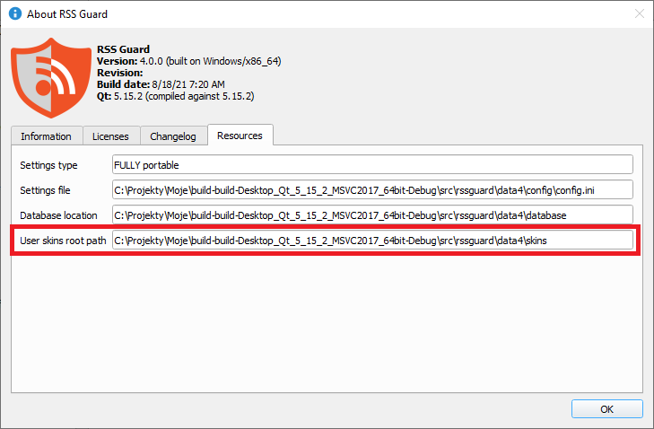

Skins
=====
RSS Guard is a skinnable application. With [Qt stylesheets](https://doc.qt.io/qt-5/stylesheet.html), the GUI can be changed almost entirely.


```{note}
The skin `API` documented below is very extensible and allows tweaking the visual part of RSS Guard in many ways without much work.
```

You can select a style and skin in the `Settings -> User interface` dialog section.

Try to play around with various combinations of styles and skins to achieve the UI you like.

Creating a custom UI is possible with `skins`. Each skin should be placed in its own root folder and must contain specific files. The [built-in skins](https://github.com/martinrotter/rssguard/tree/master/resources/skins) are stored in the folder together with the RSS Guard executable, but you can place your own custom skins in a `skins` subfolder of the [user data](userdata) folder. Create the folder manually if it does not exist.



For example, if your new skin is called `greenland`, the folder path should be as follows:

```
<user-data-path>\skins\greenland
```

As stated above, there are specific files that each skin folder must contain:
* `metadata.xml` - XML file with basic information about the skin's name, author, etc.
* `qt_style.qss` - [Qt stylesheet](https://doc.qt.io/qt-5/stylesheet.html) file
* `qt_style_forced.qss` - Qt stylesheet which is applied every time, even with `Use skin colors` turned off
* `html_style.css` - master CSS which is applied to each article
* `html_*.html` - HTML files which are dynamically combined to create complete HTML pages for the article viewer

Note that not all skins have to provide full-blown theming for every UI component of RSS Guard. A skin can provide just a custom HTML/CSS setup for the article viewer and minimal Qt CSS styling for UI controls.

Skins usually define a custom color palette, which is yet another mechanism for changing the look of RSS Guard. This skin subfeature is enabled with the `Use skin colors` checkbox in the `Settings -> User interface` dialog section.
