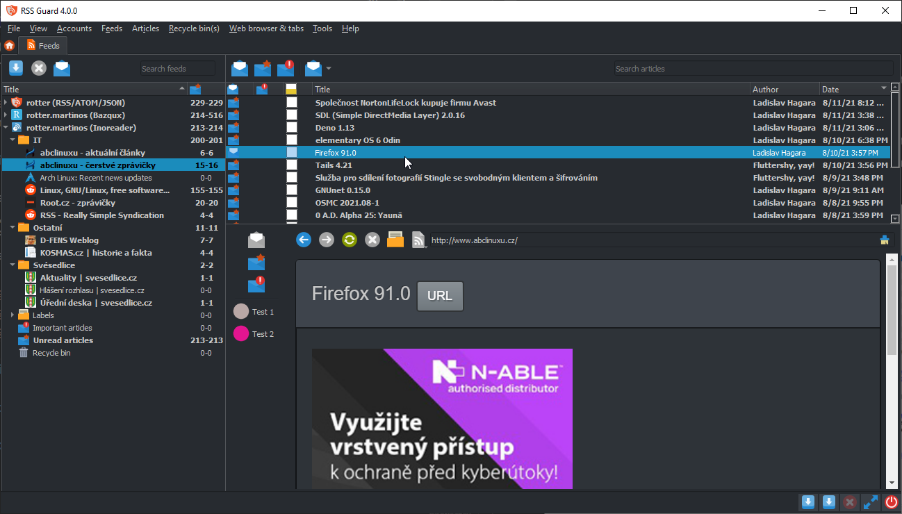

Skins
=====
RSS Guard supports customizable skins for both the application interface and the built-in article viewer.

You can choose the active style and skin in `Settings -> User interface`, and you can further adjust some skin-defined colors there too.



## What A Skin Can Change
A skin can affect:
* the general Qt widget appearance through `QSS`
* the article viewer HTML and CSS
* selected application colors used in item lists and other dynamic UI parts
* in some cases, the application palette used by supported Qt styles

In practice, a skin can be very small and only restyle article rendering, or it can try to theme much more of the application.

## Where Skins Are Loaded From
Built-in skins are stored with the application in `resources/skins`.

Custom skins can be placed in a `skins` subfolder of the RSS Guard [user-data folder](userdata). Create that folder manually if it does not exist.

For example, if your custom skin is called `greenland`, the folder would be:

```text
<user-data-path>\skins\greenland
```

## Skin Structure
A selectable skin needs a `metadata.xml` file. It can then provide one or more of the following files:
* `qt_style.qss` - regular Qt stylesheet data used when skin colors are enabled
* `qt_style_forced.qss` - stylesheet rules that are always applied
* `html_wrapper.html` - outer HTML wrapper for article pages
* `html_style.css` - CSS injected into the article wrapper
* `html_single_message.html` - template for the main article body
* `html_enclosure_every.html` - template for generic enclosures
* `html_enclosure_image.html` - template for image enclosures

Not every skin has to provide every file directly.

## Base Skins And Inheritance
RSS Guard supports skin inheritance via the `base` attribute in `metadata.xml`.

This means a skin can reuse files from another skin and override only the parts it wants to change. That is how the built-in skins are organized: a shared base skin provides common article templates and other shared resources, while specific skins provide their own metadata, colors, and selected overrides.

This is an important practical detail for skin authors: you do not need to duplicate everything if you are building on top of an existing base skin.

## `metadata.xml`
The metadata file stores the skin's descriptive data and some behavior flags.

It can define:
* visible skin information such as author, version, and description
* a `base` skin
* a small color palette for dynamic UI elements
* optional forced Qt styles
* whether the skin forces skin colors
* an optional full Qt-style palette for supported styles

## Use Skin Colors
The `Use skin colors` option in `Settings -> User interface` enables the skin's color/palette side where supported.

This matters most for:
* Qt styles that work well with alternative palettes, such as `Fusion`
* skins that define a palette or skin-specific `QSS`

If a skin explicitly forces skin colors, this option is effectively locked by the skin itself.

```{note}
Skin colors for dialogs and controls only work well with some styles. In practice, `Fusion` is one of the safest choices.
```

## Custom Skin Colors
RSS Guard also lets you override some predefined skin colors in `Settings -> User interface -> Custom skin colors`.

These colors are used dynamically for things such as:
* items with new articles
* interesting items
* errored items
* disabled items
* an “OK-ish” status color used in some views

This is useful when you like a skin overall but want better contrast or slightly different highlight colors.

## Article Viewer Templates
Article rendering is skin-driven too.

RSS Guard combines the article templates and CSS to build the final HTML shown in the embedded viewer. The skin templates can control things like:
* article header layout
* author, date, and feed placement
* link styling
* enclosure rendering
* image enclosure presentation
* left-to-right versus right-to-left layout markers

That makes skins useful not only for the surrounding application UI, but also for the readability of articles themselves.

## Useful Placeholders
Skin templates use placeholders that RSS Guard replaces when generating article HTML.

For example, article templates can receive values such as:
* title
* author
* feed title
* article URL
* article contents
* article date
* enclosure markup

The wrapper HTML also uses a `%style%` placeholder for injected article CSS.

In local skin files, `%data%` can be used in stylesheet/resource paths and is replaced with the actual skin folder path.

## Practical Advice For Skin Authors
* Start from an existing built-in skin instead of creating everything from scratch.
* Use a base skin if you want to maintain multiple variants.
* Test with the `Fusion` style if your skin depends on palette-based UI coloring.
* Keep article HTML simple and robust, because article contents can vary a lot between feeds.
* Treat `Reload skin` mainly as a debugging helper. For a clean final test, restart RSS Guard.

## Limitations And Notes
* Some visual results depend on the selected Qt style, not only on the skin itself.
* If a Qt style is forced externally, for example by environment or command-line override, RSS Guard respects that.
* Some skins may only theme articles and leave most standard widgets close to the system look.
* A broken or incomplete skin may fail to load, in which case RSS Guard falls back to a working default.
