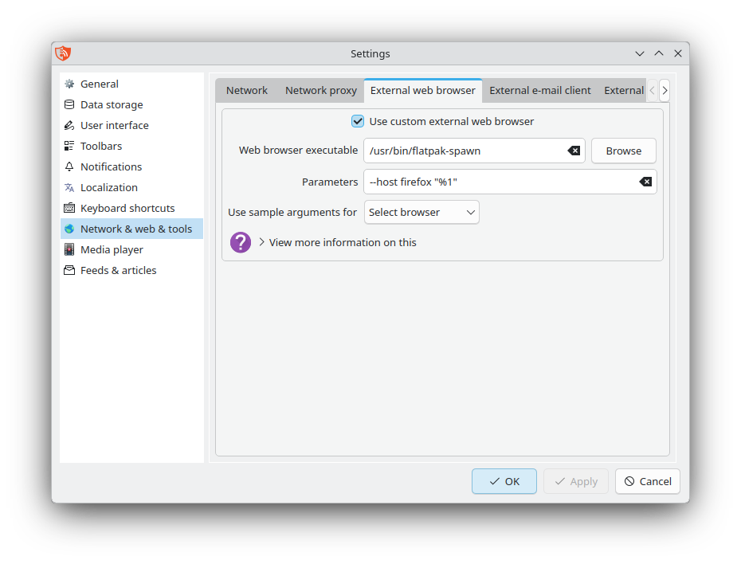
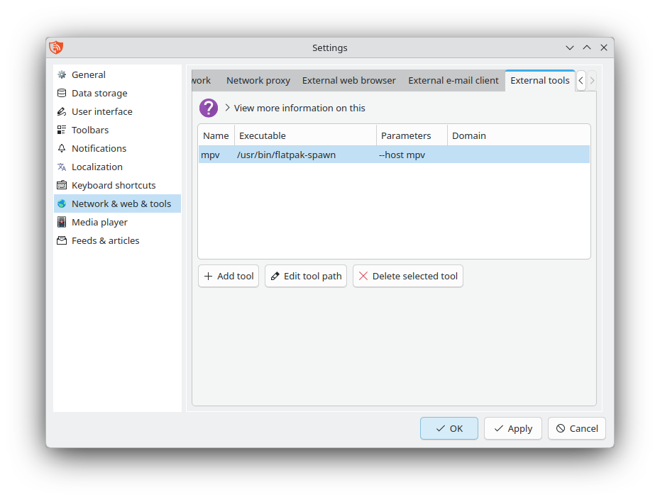
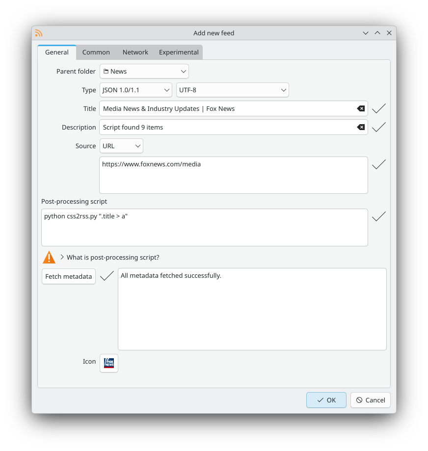

Flatpak package
===============

If you have installed RSS Guard [from Flathub](https://flathub.org/en/apps/io.github.martinrotter.rssguard), you may notice that some features do not work out of the box. This is mainly due to Flatpak's sandboxing model, which significantly limits how RSS Guard interacts with other applications on the system, as well as with files and directories.

## Launching at system startup

To enable RSS Guard to start automatically at system startup, you must first grant it write access to the `~/.config/autostart` directory. Run the following command:

```sh
flatpak override --user --filesystem=xdg-config/autostart io.github.martinrotter.rssguard
```

After that, restart RSS Guard and follow these steps:

1. Go to **Tools** > **Settings**.
2. Select the **General** category in the left panel.
3. Tick the **Launch RSS Guard on operating system startup** checkbox.
4. Click the **Apply** button to save your settings.

## Using an external web browser

To allow RSS Guard to open links using a custom web browser, you must first grant it permission to launch other applications on the system. Run the following command:

```sh
flatpak --user override --talk-name=org.freedesktop.Flatpak io.github.martinrotter.rssguard
```

After that, restart RSS Guard and follow these steps:

1. Go to **Tools** > **Settings**.
2. Select the **Network & web & tools** category in the left panel.
3. Navigate to the **External web browser** tab.
4. Tick the **Use custom external web browser** checkbox.
5. In the **Web browser executable** field, type this: `/usr/bin/flatpak-spawn`
6. In the **Parameters** field, type this: `--host firefox "%1"` (**NOTE:** Replace `firefox` with your browser of choice).
7. Click the **Apply** button to save your settings.

Your configuration should look similar to this:



## Adding external tools

To allow RSS Guard to run external tools, you must first grant it permission to launch other applications on the system. Run the following command:

```sh
flatpak --user override --talk-name=org.freedesktop.Flatpak io.github.martinrotter.rssguard
```

After that, restart RSS Guard and follow these steps:

1. Go to **Tools** > **Settings**.
2. Select the **Network & web & tools** category in the left panel.
3. Navigate to the **External tools** tab.
4. Click the **+ Add tool** button to add a new tool.
5. Double-click the **New tool** row and choose any name for it.
6. Double-click below the **Executable** column and type this: `/usr/bin/flatpak-spawn`
7. Double-click below the **Parameters** column and type this: `--host mpv` (**NOTE**: Replace `mpv` with your tool of choice).
8. Click the **Apply** button to save your settings.

Your configuration should look similar to this:



## Using CSS2RSS

It is possible to use [CSS2RSS](https://github.com/Owyn/CSS2RSS) without breaking the Flatpak sandbox. For this, you will need to run a few commands in a terminal window.

1. Install the appropriate Flatpak SDK so we can use `pip` to install CSS2RSS's dependencies:

```
flatpak install org.freedesktop.Sdk//25.08
```

2. Install CSS2RSS's dependencies:

```
flatpak run --runtime=org.freedesktop.Sdk//25.08 --command=pip io.github.martinrotter.rssguard install beautifulsoup4 maya
```

3. Download CSS2RSS inside RSS Guard's configuration directory for easier use later:

```
flatpak run --command=curl io.github.martinrotter.rssguard https://raw.githubusercontent.com/Owyn/CSS2RSS/refs/heads/main/css2rss.py -o ~/.var/app/io.github.martinrotter.rssguard/config/rssguard5/css2rss.py
```

4. Uninstall the Flatpak SDK, as it is no longer needed:

```
flatpak uninstall org.freedesktop.Sdk//25.08
```

You can then immediately start using CSS2RSS by filling out the **Post-processing script** field when you add or edit a feed, like this:


