# 🔥 RSS Guard Documentation 🔥

Welcome to RSS Guard documentation. You can find everything about the application right here.

There is a [Discord server](https://discord.gg/7xbVMPPNqH) for user communication.

## Table of Contents
- [What is RSS Guard?](#wirss)
- [Donations](#donat)
- [Downloads](#dwn)
- [Supported Operating Systems](#sos)
- [Supported Feed Readers](#sfr)
- [Features](#fe)
- [For Contributors and Other Topics](#contrib)

<hr style="margin: 40px;"/>

## What is RSS Guard? <a id="wirss"></a>
RSS Guard is an [open-source](https://en.wikipedia.org/wiki/Open_source) [cross-platform](#sos) [multi-protocol](#sfr) desktop feed reader. It is able to fetch feeds in RSS/RDF/ATOM/JSON formats and connect to multiple web-based feed readers. RSS Guard is developed on top of the [Qt library](http://qt-project.org).

## Donations <a id="donat"></a>
You can support author of RSS Guard via [donations](https://github.com/sponsors/martinrotter).

## Downloads <a id="dwn"></a>
Official place to download RSS Guard is at [Github Releases page](https://github.com/martinrotter/rssguard/releases). You can also download the [development (beta) build](https://github.com/martinrotter/rssguard/releases/tag/devbuild), which is updated automatically every time the source code is updated.

RSS Guard is also available in [repositories of many Linux distributions](https://repology.org/project/rssguard/versions), and via [Flathub](https://flathub.org/about).

The are two different flavors:

- [Regular](https://flathub.org/apps/details/io.github.martinrotter.rssguard): Includes an (almost) full-blown integrated web browser (built with `-DUSE_WEBENGINE=ON`).
- [Lite](https://flathub.org/apps/details/io.github.martinrotter.rssguardlite): Includes simpler, safer (and less memory hungry integrated web browser (built with `-DUSE_WEBENGINE=OFF`).

I highly recommend to download RSS Guard only from trusted sources.

## Supported Operating Systems <a id="sos"></a>
RSS Guard is a cross-platform application, and at this point it is known to work on:
* Windows 7+
* GNU/Linux (including PinePhone and other Linux-based phone operating systems)
* BSD (FreeBSD, OpenBSD, NetBSD, etc.)
* macOS 10.14+
* OS/2 (ArcaOS, eComStation)

## Supported Feed Readers <a id="sfr"></a>
RSS Guard is multi-account application and supports many web-based feed readers via [built-in plugins](#papi). One of the plugins, of course, provides the support for standard list of **RSS/ATOM/JSON** feeds with the set of features everyone would expect from classic feed reader.

I organized the supported web-based feed readers into an elegant table:

| Service | Two-way Synchronization | [Intelligent Synchronization Algorithm](#intel) (ISA) <sup>1</sup> | Synchronized Labels <sup>2</sup> <a id="sfrl"></a> | OAuth <sup>4</sup> |
| :---              | :---:  | :---: | :---: | :---:
| Feedly            | ✅ | ✅ | ✅ | ✅ (only for official binaries)
| Gmail             | ✅ | ✅ | ✅ | ✅
| Google Reader API <sup>3</sup> | ✅ | ✅ | ✅ | ✅ (only for Inoreader)
| Nextcloud News    | ✅ | ❌ | ❌ | ❌
| Tiny Tiny RSS     | ✅ | ✅ | ✅ | ❌

<sup>1</sup> Some plugins support next-gen intelligent synchronization algorithm (ISA) which has some benefits, as it usually offers superior synchronization speed, and transfers much less data over your network connection. <a id="intel"></a>

With ISA, RSS Guard only downloads articles which are new or were updated by remote server. The old algorithm usually always fetches all available articles, even if they are not needed, which leads to unnecessary overload of your network connection and the RSS Guard.

<sup>2</sup> Note that [labels](#lbls) are supported for all plugins, but for some plugins they are local-only, and are not synchronized with the service. Usually because service itself does not support the feature.

<sup>3</sup> Tested services are:
* Bazqux
* FreshRSS
* Inoreader
* Miniflux
* Reedah
* TheOldReader

<sup>4</sup> [OAuth](https://en.wikipedia.org/wiki/OAuth) is a secure way of authenticating users in online applications.

## Features & How-tos <a id="fe"></a>
Here you can read detailed description of all RSS Guard features.

### General GUI concepts & manipulating accounts & adding feeds.
Main RSS Guard window is separated into three main areas:
* feed list (left side)
* article list (top-right side)
* article preview (top-bottom side)

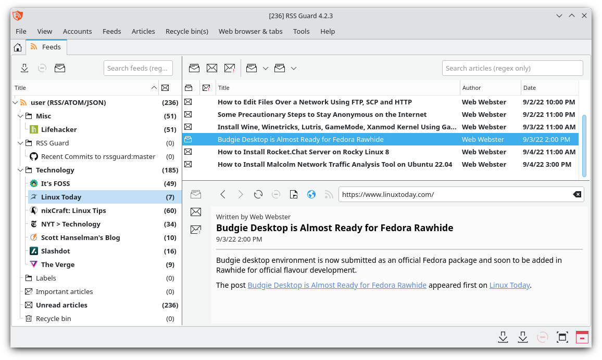

Feed list displays all your feeds and other items such as recycle bin.

Article list displays all your articles depending on what is selected in feed list.

Article preview displays details of selected article or information about selected item from feed list if no article is selected.

Titlebar of RSS Guard display number of unread articles in square brackets.

There are two toolbars available, separate toolbar for feed list and for article list.

----

When you start RSS Guard for the very first time, you are greeted with `Add account` dialog where you select which account you want to operate with. If you want to have classic `RSS/ATOM` feed reader, then select `RSS/RDF/ATOM/JSON` option.


Each "account" offers account-specific actions which are accessible in relevant submenu.

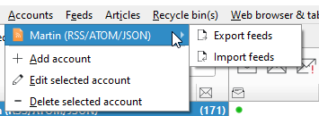

To add new feed into the account you simply use `Feeds -> Add item -> Add a new feed` menu item.


In 99 % of cases, you only need to insert feed URL into `Source` field and then hit `Fetch it now` button which will download feed metadata and fill all other boxes.

### Article Filtering <a id="fltr"></a>
Sometimes you need to automatically tweak the incoming article - mark it starred, remove ads from its contents, or simply ignore it. That's where article filtering feature comes in.

#### `Article filters` dialog
The dialog seen below offers you a way of managing your article filters. You can assign single filter to multiple feeds.

`Test` button tests selected filter against existing messages. `Process checked feeds` runs the filter against messages from checked feeds.

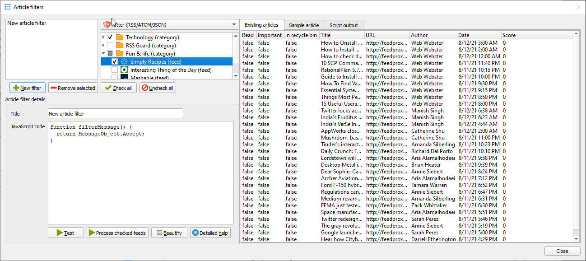

#### Writing article filter
Article filters are small scripts which are executed automatically when articles/feeds are downloaded. Article filters are `JavaScript` pieces of code which must provide function with prototype:

```js
function filterMessage() { }
```

The function should be fast and must return values which belong to enumeration [`FilteringAction`](#FilteringAction-enum).

Each article is accessible in your script via global variable named `msg` of type `MessageObject`, see [this file](https://github.com/martinrotter/rssguard/blob/master/src/librssguard/core/messageobject.h) for the declaration. Some properties are writeable, allowing you to change contents of the article before it is written to RSS Guard DB. You can mark article important, change its description, perhaps change author name or even assign some label to it!!!

Some attributes (`read/unread/starred` states) are synchronized back to your account's server - so you can for example mark some articles as starred and the change will be propagated back to TT-RSS server if you use TT-RSS.

A [special placeholders](#userd-plac) can be used in article filters.

There is also a special variable named `utils`. This variable is of `FilterUtils` type. It offers some useful [utility functions](#utils-object) for you to use in your filters.

Labels assigned to articles are visible to your filters. You can, therefore, execute actions in your filtering script, based on which labels are assigned to the article. The property is called `assignedLabels` and is an array of the [`Label`](#Label-class) objects.

Passed article also offers a special function:

```js
Boolean MessageObject.isAlreadyInDatabase(DuplicateCheck)
```

which allows you to perform runtime check for existence of the article in RSS Guard's database. Parameter is the value from enumeration [`DuplicateCheck`](#dupl-check). It specifies how exactly the article should match.

For example, if you want to check if there is already another article by the same author in a database, you should call `msg.isAlreadyInDatabase(MessageObject.SameAuthor)`.  
The values of enumeration can be combined in a single call with the [bitwise OR](https://developer.mozilla.org/en-US/docs/Web/JavaScript/Reference/Operators/Bitwise_OR) (`|`) operator, like this:

```js
msg.isAlreadyInDatabase(MessageObject.SameAuthor | MessageObject.SameUrl)
```

Here is the reference of methods and properties of types available in your filtering scripts.

#### `MessageObject` class
| Type      | Name(Parameters)              | Return value  | Read-only  | Synchronized  | Description
| :---      | :---                          | :---          | :---:      | :---:         | ---
| Property  | `assignedLabels`              | `Array<Label>`| ✅         | ✅            | List of labels assigned to the message/article.
| Property  | `availableLabels`             | `Array<Label>`| ✅         | ❌            | List of labels which are currently available and can be assigned to the message. Available in RSS Guard 3.8.1+.
| Property  | `feedCustomId`                | `String`      | ✅         | ❌            | Service-specific ID of the feed which this message belongs to.
| Property  | `accountId`                   | `Number`      | ✅         | ❌            | RSS Guard's ID of the account activated in the program. This property is highly advanced, and you probably do not need to use it at all.
| Property  | `id`                          | `Number`      | ✅         | ❌            | ID assigned to the message in RSS Guard local database.
| Property  | `customId`                    | `String`      | ❌         | ❌            | ID of the message as provided by the remote service or feed file.
| Property  | `title`                       | `String`      | ❌         | ❌            | The message title.
| Property  | `url`                         | `String`      | ❌         | ❌            | The message URL.
| Property  | `author`                      | `String`      | ❌         | ❌            | Author of the message.
| Property  | `contents`                    | `String`      | ❌         | ❌            | Contents of the message.
| Property  | `rawContents`                 | `String`      | ❌         | ❌            | This is the RAW contents of the message obtained from remote service/feed. A raw XML or JSON element data. This attribute has the value only if `runningFilterWhenFetching` returns `true`. In other words, this attribute is not persistently stored in the RSS Guard's DB. Also, this attribute is artificially filled in with ATOM-like data when testing the filter.
| Property  | `score`                       | `Number`      | ❌         | ❌            | Arbitrary number in range \<0.0, 100.0\>. You can use this number to sort messages in a custom fashion as this attribute also has its own column in articles list.
| Property  | `created`                     | `Date`        | ❌         | ❌            | Date/time of the message.
| Property  | `isRead`                      | `Boolean`     | ❌         | ✅            | Is message read?
| Property  | `isImportant`                 | `Boolean`     | ❌         | ✅            | Is message important?
| Property  | `isDeleted`                   | `Boolean`     | ❌         | ❌            | Is message placed in recycle bin?
| Method    | `addEnclosure(String url, String mime_type)` | `void` | ❌         | ❌            | Adds multimedia attachment to the article.
| Method    | `isAlreadyInDatabase(DuplicateCheck criteria)` | `Boolean` | ❌         | ❌            | Allows you to check if message is already stored in the RSS Guard's DB. See [possible parameters](#dupl-check).
| Method    | `findLabelId(String label_name)`         | `String`     | ❌         | ❌            | If you enter the label name, method returns label's `customId` which then can be used in `assignLabel()` and `deassignLabel` methods.
| Method    | `assignLabel(String label_id)`         | `Boolean`     | ❌         | ❌            | Assigns label to the message. The `String` value is the `customId` property of `Label` type. See its API reference for relevant info.
| Method    | `deassignLabel(String label_id)`       | `Boolean`     | ❌         | ❌            | Removes label from the message. The `String` value is the `customId` property of `Label` type. See its API reference for relevant info.
| Method    | `createLabelId(String title, String color_hex_code)`       | `String`     | ❌         | ❌            | Creates the label with given name and given color hex code in form `#AABBCC`. Color can be omitted in which case auto-generated color is used.
| Method    | `addEnclosure(String url, String mime_type)`       | `void`     | ❌         | ❌            | Appends new enclosure/attachment with given URL and MIME type to the article.
| Property  | `runningFilterWhenFetching`   | `Boolean`     | ✅         | ❌            | Returns `true` if message filter is applied when message is fetched. Returns `false` if filter is applied manually, for example from **Article filters** window.<!-- TODO: is there another example when it's applied? should "for example" be dropped? -->

#### `Label` class
| Type      | Name          | Return value  | Read-only | Description
| :---      | :---          | :---          | :---:     | ---
| Property  | `title`       | `String`      | ✅        | Label name.
| Property  | `customId`    | `String`      | ✅        | Service-specific ID of the label. The ID is used as a unique identifier for label. It is useful if you want to assign/unassign the message label.
| Property  | `color`       | `Color`       | ✅        | Label color. See the type `color` documentation in [Qt docs](https://doc.qt.io/qt-5/qml-color.html).

#### `FilteringAction` enum
| Enumerant name    | Integer value | Description
| :---              | :---          | ---
| `Accept`          | 1             | Message is accepted and will be added or updated in DB.
| `Ignore`          | 2             | Message is ignored and will **NOT** be added or updated in DB. Already existing message will not be purged from DB.
| `Purge`           | 4             | Existing message is purged from the DB completely. Behaves like `Ignore` when there is a new incoming message.

The `MessageObject` attributes are synchronized with service even if you return `Purge` or `Ignore`. In other words, even if the filter ignores the article, you can still tweak its properties, and they will be synchronized back to your server.

#### `DuplicateCheck` enum <a id="dupl-check"></a>
| Enumerant name    | Integer value | Description
| :---              | :---          | ---
| `SameTitle`       | 1             | Check if message has same title as some another messages.
| `SameUrl`         | 2             | Check if message has same URL as some another messages.
| `SameAuthor`      | 4             | Check if message has same author as some another messages.
| `SameDateCreated` | 8             | Check if message has same date of creation as some another messages.
| `AllFeedsSameAccount` | 16        | Perform the check across all feeds from your account, not just "current" feed.
| `SameCustomId`    | 32            | Check if message with same custom ID exists in RSS Guard DB.

#### `utils` object
| Type      | Name(Parameter)           | Return value  | How to call                               | Description
| :---      | :---                      | :---          | :---                                      | ---
| Method    | `hostname()`              | `String`      | `utils.hostname()`                        | Returns name of your PC.
| Method    | `fromXmlToJson(String xml_string)`   | `String`      | `utils.fromXmlToJson('<h1>hello</h1>')`   | Converts XML string into JSON.
| Method    | `parseDateTime(String date_time)`   | `Date`        | `utils.parseDateTime('2020-02-24T08:00:00')`  | Converts textual date/time representation into proper `Date` object.
| Method    | `runExecutableGetOutput(String exec, String[] params)`   | `String`        | `utils.runExecutableGetOutput('cmd.exe', ['/c', 'dir'])`  | Launches external executable with optional parameters, reads its standard output, and returns the output when executable finishes.

#### Examples
Accept only messages/articles with title containing "Series Name" or "Another series" in it (whitelist):
```js
var whitelist = [
  'Series Name', 'Another series'
];
function filterMessage() {
  if (whitelist.some(i => msg.title.indexOf(i) != -1)) {
    return MessageObject.Accept;
  } else {
    return MessageObject.Ignore;
  }
}
```

Accept only messages/articles with title NOT containing "Other Series Name" or "Some other title" in it (blacklist):
```js
var blacklist = [
  'Other Series Name', 'Some other title'
];
function filterMessage() {
  if (blacklist.some(i => msg.title.indexOf(i) != -1)) {
    return MessageObject.Ignore;
  } else {
    return MessageObject.Accept;
  }
}
```

Accept only messages/articles from "Bob", while also mark them important:
```js
function filterMessage() {
  if (msg.author == "Bob") {
    msg.isImportant = true;
    return MessageObject.Accept;
  }
  else {
    return MessageObject.Ignore;
  }
}
```

Replace all "dogs" with "cats"!
```js
function filterMessage() {
  msg.title = msg.title.replace("dogs", "cats");
  return MessageObject.Accept;
}
```

Use published element instead of updated element (for `ATOM` entries only):
```js
function filterMessage() {
  // Read raw contents of message and
  // convert to JSON.
  json = utils.fromXmlToJson(msg.rawContents);
  jsonObj = JSON.parse(json)

  // Read published date and parse it.
  publishedDate = jsonObj.entry.published.__text;
  parsedDate = utils.parseDateTime(publishedDate);

  // Set new date/time for message and
  // proceed.
  msg.created = parsedDate;
  return MessageObject.Accept;
}
```

Dump RAW data of each message to RSS Guard [debug output](#reprt):
```js
function filterMessage() {
  console.log(msg.rawContents);
  return MessageObject.Accept;
}
```

When running the above script for Tiny Tiny RSS, it produces the following debug output:
```log
...
time="    34.360" type="debug" -> feed-downloader: Hooking message took 4 microseconds.
time="    34.361" type="debug" -> {"always_display_attachments":false,"attachments":[],"author":"Aleš Kapica","comments_count":0,"comments_link":"","content":"<p>\nNaposledy jsem psal o čuňačení v MediaWiki asi před půl rokem, kdy jsem chtěl upozornit na to, že jsem přepracoval svoji původní šablonu Images tak, aby bylo možné používat výřezy z obrázků a stránek generovaných z DjVu a PDF dokumentů. Blogpost nebyl nijak extra hodnocen, takže mě vcelku nepřekvapuje, jak se do hlavní vývojové větve MediaWiki dostávají čím dál větší prasečiny.\n</p>","feed_id":"5903","feed_title":"abclinuxu - blogy","flavor_image":"","flavor_stream":"","guid":"{\"ver\":2,\"uid\":\"52\",\"hash\":\"SHA1:5b49e4d8f612984889ba25e7834e80604c795ff8\"}","id":6958843,"is_updated":false,"labels":[],"lang":"","link":"http://www.abclinuxu.cz/blog/kenyho_stesky/2021/1/cunacime-v-mediawiki-responzivni-obsah-ii","marked":false,"note":null,"published":false,"score":0,"tags":[""],"title":"Čuňačíme v MediaWiki - responzivní obsah II.","unread":true,"updated":1610044674}
time="    34.361" type="debug" -> feed-downloader: Running filter script, it took 348 microseconds.
time="    34.361" type="debug" -> feed-downloader: Hooking message took 4 microseconds.
time="    34.361" type="debug" -> {"always_display_attachments":false,"attachments":[],"author":"kol-ouch","comments_count":0,"comments_link":"","content":"Ahoj, 1. 6. se blíží, tak začínám řešit co s bambilionem fotek na google photos. \n<p class=\"separator\"></p>\nZa sebe můžu říct, že gp mi vyhovují - ne snad úplně tím, že jsou zadarmo, ale hlavně způsobem práce s fotkami, možnostmi vyhledávání v nich podle obsahu, vykopírování textu z nich, provázaností s mapami, recenzemi, možnostmi sdílení, automatickým seskupováním a podobně.","feed_id":"5903","feed_title":"abclinuxu - blogy","flavor_image":"","flavor_stream":"","guid":"{\"ver\":2,\"uid\":\"52\",\"hash\":\"SHA1:1277107408b159882b95ca7151a0ec0160a3971a\"}","id":6939327,"is_updated":false,"labels":[],"lang":"","link":"http://www.abclinuxu.cz/blog/Co_to_je/2021/1/kam-s-fotkama","marked":false,"note":null,"published":false,"score":0,"tags":[""],"title":"Kam s fotkama?","unread":true,"updated":1609750800}
...
```

For `RSS 2.0` message, the result might look as follows:
```log
...
time="     3.568" type="debug" -> feed-downloader: Hooking message took 6 microseconds.
time="     3.568" type="debug" -> <item>
<title><![CDATA[Man Utd's Cavani 'not comfortable' in England, says father]]></title>
<description><![CDATA[Manchester United striker Edinson Cavani "does not feel comfortable" and could move back to his native South America, his father said.]]></description>
<link>https://www.bbc.co.uk/sport/football/56341983</link>
<guid isPermaLink="true">https://www.bbc.co.uk/sport/football/56341983</guid>
<pubDate>Tue, 09 Mar 2021 23:46:03 GMT</pubDate>
</item>

time="     3.568" type="debug" -> feed-downloader: Running filter script, it took 416 microseconds.
...
```

Write details of available labels and assign the first label to the message:
```js
function filterMessage() {
  console.log('Number of assigned labels: ' + msg.assignedLabels.length);
  console.log('Number of available labels: ' + msg.availableLabels.length);

  var i;
  for (i = 0; i < msg.availableLabels.length; i++) {
    var lbl = msg.availableLabels[i];

    console.log('Available label:');
    console.log('  Title: \'' + lbl.title + '\' ID: \'' + lbl.customId + '\'');
  }

  if (msg.availableLabels.length > 0) {
    console.log('Assigning first label to message...');
    msg.assignLabel(msg.availableLabels[0].customId);

    console.log('Number of assigned labels ' + msg.assignedLabels.length);
  }

  console.log();
  return MessageObject.Accept;
}
```

Make sure that you receive only one message with particular URL across all your feeds, plugin/account-wide. All other messages with the same URL are subsequently ignored:
```js
function filterMessage() {
  if (msg.isAlreadyInDatabase(MessageObject.SameUrl | MessageObject.AllFeedsSameAccount)) {
    return MessageObject.Ignore;
  }
  else {
    return MessageObject.Accept;
  }
}
```

Remove "ads" from messages received from Inoreader. Method simply removes `div` which contains the advertisement:
```js
function filterMessage() {
  msg.contents = msg.contents.replace(/<div>\s*Ads[\S\s]+Remove<\/a>[\S\s]+adv\/www\/delivery[\S\s]+?<\/div>/im, '');

  return MessageObject.Accept;
}
```

### Websites Scraping <a id="scrap"></a>
> **Only proceed if you consider yourself a power user, and you know what you are doing!**

RSS Guard offers additional advanced feature inspired by [Liferea](https://lzone.de/liferea/).

Goal of this feature is to allow advanced users to use RSS Guard with data sources which do not provide regular feed. So you can use the feature to generate one.

You can select source type of each feed. If you select URL, then RSS Guard simply downloads feed file from given location and behaves like everyone would expect.

However, if you choose `Script` option, then you cannot provide URL of your feed, and you rely on custom script to generate feed file and provide its contents to [**standard output** (stdout)](https://en.wikipedia.org/wiki/Standard_streams#Standard_output_(stdout)). Data written to standard output should be valid feed file, for example RSS or ATOM XML file.

`Fetch it now` button also works with `Script` option. Therefore, if your source script and (optional) post-process script in cooperation deliver a valid feed file to the output, then all important metadata, like title or icon of the feed, can be discovered :sparkles: automagically :sparkles:.

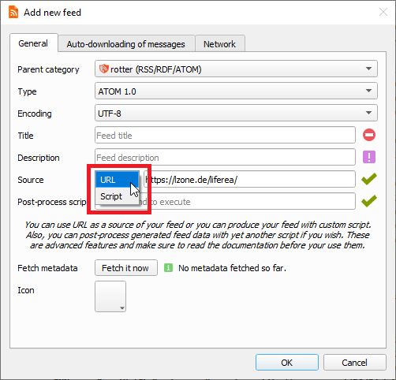

Any errors in your script must be written to [**error output** (stderr)](https://en.wikipedia.org/wiki/Standard_streams#Standard_error_(stderr)).

> **As of RSS Guard 4.2.0, you cannot separate your arguments with `#`. If your argument contains spaces, then enclose it with DOUBLE quotes, for example `"my argument"`. DO NOT use SINGLE quotes to do that.**

Format of post-process script execution line can be seen on picture below.

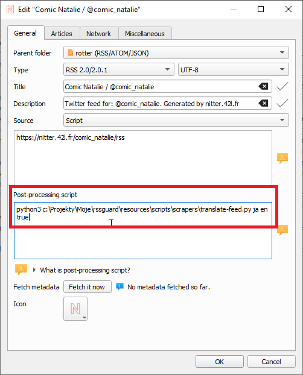

If everything goes well, script must return `0` as the process exit code, or a non-zero exit code if some error happened.

Executable file must be always be specified, while arguments do not. Be very careful when quoting arguments. Tested examples of valid execution lines are:

| Command       | Explanation   |
| :---          | ---           |
| `bash -c "curl 'https://github.com/martinrotter.atom'"`   | Download ATOM feed file using Bash and Curl. |
| `Powershell Invoke-WebRequest 'https://github.com/martinrotter.atom' \| Select-Object -ExpandProperty Content` | Download ATOM feed file with Powershell. |
| `php tweeper.php -v 0 https://twitter.com/NSACareers`     | Scrape Twitter RSS feed file with [Tweeper](https://git.ao2.it/tweeper.git). Tweeper is the utility that produces RSS feed from Twitter and other similar social platforms. |

Note that the above examples are cross-platform. You can use exactly the same command on Windows, Linux or macOS, if your operating system is properly configured.

RSS Guard offers [placeholder](#userd-plac) `%data%` which is automatically replaced with full path to RSS Guard [user's data folder](#userd), allowing you to make your configuration fully portable. You can, therefore, use something like this as a source script line: `bash %data%/scripts/download-feed.sh`.

Also, working directory of process executing the script is set to point to RSS Guard user's data folder.

There are [examples of website scrapers](https://github.com/martinrotter/rssguard/tree/master/resources/scripts/scrapers). Most of them are written in Python 3, so their execution line is similar to `python script.py`. Make sure to examine each script for more information on how to use it.

After your source feed data is downloaded either via URL or custom script, you can optionally post-process it with one more custom script, which will take **raw source data as input**. It must produce valid feed data to [**standard output** (stdout)] while printing all error messages to [**error output** (stderr)].

Here is little flowchart explaining where and when scripts are used:

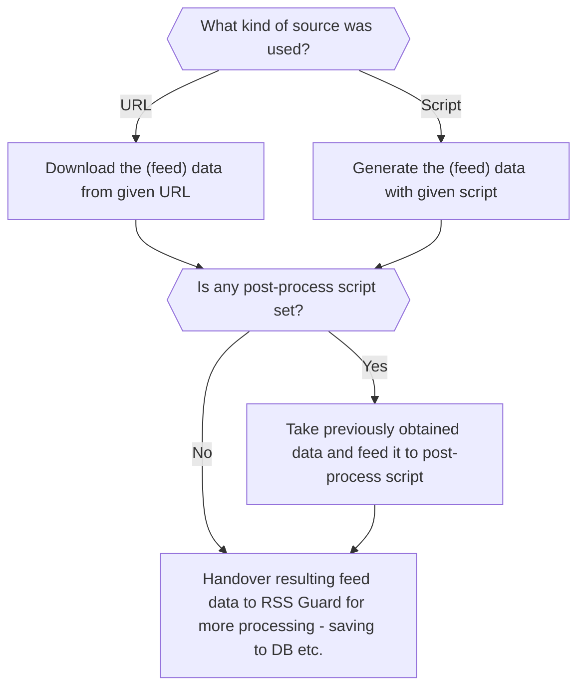

Typical post-processing filter might do things like CSS formatting, localization of content to another language, downloading of complete articles, some kind of filtering, or removing ads.

It's completely up to you if you decide to only use script as `Source` of the script or separate your custom functionality between `Source` script and `Post-process` script. Sometimes you might need different `Source` scripts for different online sources and the same `Post-process` script and vice versa.

Third-party tools for scraping made to work with RSS Guard:
* [CSS2RSS](https://github.com/Owyn/CSS2RSS) - can be used to scrape websites with CSS selectors.
* [RSSGuardHelper](https://github.com/pipiscrew/RSSGuardHelper) - another CSS selectors helper.

Make sure to give credit to authors that they deserve.

### Notifications <a id="notif"></a>
RSS Guard allows you to customize desktop notifications. There are a number of events which can be configured:
* New (unread) articles fetched
* Fetching of articles is started
* Login OAuth tokens are refreshed
* New RSS Guard version is available
* etc.


Your notification can also play `.wav` sounds which you can place under your [user's data folder](#userd) and use them via [special placeholder](#userd-plac). Other audio formats are not supported.

### Database Backends <a id="datab"></a>
RSS Guard offers switchable database backends to hold your data. At this point, two backends are available:
* MariaDB
* SQLite (default)

SQLite backend is very simple to use, no further configuration needed. All your data is stored in a single file:
```
<user-data-folder>\database\database.db
```
(For path to user data folder, see [User Data Portability](#userd) section.)

This backend offers an `in-memory` database option, which automatically copies all your data into RAM when application launches, making RSS Guard incredibly fast. Data is written back to database file on disk when application exits. This option is not expected to be used often because RSS Guard should be fast enough with classic SQLite persistent DB files. Use this option only with huge amount of article data, and when you know what you are doing.

Also note, that some new versions of RSS Guard introduce changes to how application data are stored in database file. When this change happens, backup of your SQLite database file is created automatically.

MariaDB (MySQL) backend is there for users who want to store their data in a centralized way. You can have a single server in your network and use multiple RSS Guard instances to access the data.

For database-related configuration see `Settings -> Data storage` dialog section.

### User Data Portability <a id="userd"></a>
One of the main goals of RSS Guard is to have portable/relocatable user data folder so that it can be used across all [supported operating systems](#sos).

RSS Guard can run in two modes:
* **Non-portable:** The default mode, where user's data folder is placed in user-wide "config directory" (`C:\Users\<user>\AppData\Local` on Windows).  
  If the file `C:\Users\<user>\AppData\Local\RSS Guard 4\data\config\config.ini` exists, then this `<user>`'s folder is used.  
* **Portable mode:** This mode allows storing user data folder in a subfolder **data4** in the same directory as RSS Guard binary (`rssguard.exe` on Windows). This mode is used automatically if non-portable mode detection fails.

Check `Help -> About application -> Resources` dialog tab to find more info on paths used.

User data folder can store your custom icon themes in `icons` subfolder, and custom skins in `skins` subfolder.

#### `%data%` placeholder <a id="userd-plac"></a>
RSS Guard stores its data and settings in a single folder. How to find out the exact path, see [here](#userd). RSS Guard allows using the folder programmatically in some special contexts via `%data%` placeholder. You can use this placeholder in following contexts:
* Contents of your [article filters](#fltr) - you can, therefore, place some scripts under your user data folder and include them via JavaScript into your article filter.
* Contents of each file included in your custom [skins](#skin). Note that in this case, the semantics of `%data%` are little changed and `%data%` points directly to base folder of your skin.
* `source` and `post-process script` attributes for feed [scraping](#scrap) - you can use the placeholder to load scripts to generate/process the feed from user's data folder.
* Notifications also support the placeholder in path to audio files which are to be played when some event happens. For example, you could place audio files in your data folder and then use them in a notification with `%data%\audio\new-messages.wav`. See more about [notifications](#notif).

### Built-in Web Browser with AdBlock <a id="webb"></a>
RSS Guard is distributed in two variants:
* **Standard package with WebEngine-based bundled article viewer**: This variant displays messages/articles with their full formatting and layout in embedded Chromium-based web browser. This variant of RSS Guard should be okay for everyone. Also, installation packages are relatively big.

* **Lite package with simple text-based article viewer**: This variant displays article in a much simpler and much more lightweight web viewer component. All packages of this variant have `nowebengine` keyword in their names. This flavor of RSS Guard does NOT have a JavaScript support and is meant for people who value their privacy.

#### AdBlock <a id="adbl"></a>
Both variants of RSS Guard offer ad-blocking functionality via [Adblocker](https://github.com/cliqz-oss/adblocker). Adblocker offers similar performance to [uBlock Origin](https://github.com/gorhill/uBlock).

If you want to use AdBlock, you need to have [Node.js](#node) installed.

You can find elaborate lists of AdBlock rules [here](https://easylist.to). You can simply copy the direct hyperlinks to those lists and paste them into the `Filter lists` text-box as shown below. Remember to always separate individual links with newlines. The same applies to `Custom filters`, where you can insert individual filters, for example [filter](https://adblockplus.org/filter-cheatsheet) "idnes" to block all URLs with "idnes" in them.


The way ad-blocking internally works is that RSS Guard starts local HTTP server which provides ad-blocking API, which is subsequently called by RSS Guard. There is some caching done in between, which speeds up some ad-blocking decisions.

### Files Downloader <a id="downl"></a>
RSS Guard offers simple file downloader.

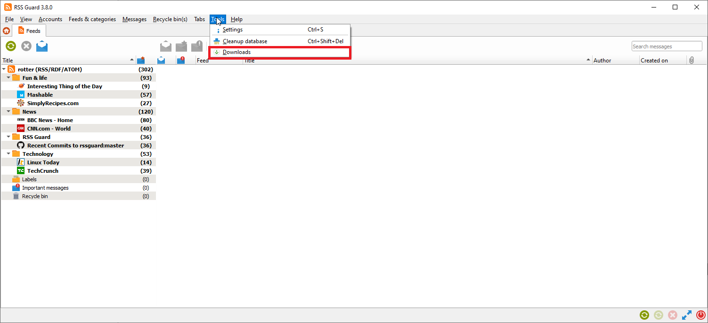

You can right-click any item in an embedded web browser and hit the `Save as` button. RSS Guard will then automatically display the downloader, and will download your file. This feature works in [both RSS Guard variants](#webb). The downloader is also fully interconnected with some RSS Guard plugins, like Gmail where you can download e-mail attachments with it.

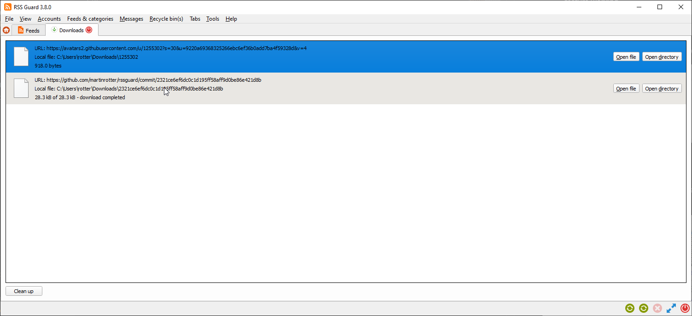

You can download up to 6 files simultaneously.

### Node.js <a id="node"></a>
RSS Guard has the [Node.js](https://nodejs.org) integration. For more information see `Node.js` section of RSS Guard `Settings` dialog.

Node.js is used for some advanced functionality like [AdBlock](#adbl).

### Labels <a id="lbls"></a>
RSS Guard supports labels (tags). Any number of tags can be assigned to any article.

Note that tags in some plugins are [synchronizable](#sfrl). 

While labels are synchronized with these services, sometimes they cannot be directly created via RSS Guard. In this case, you have to create them via web interface of the respective service, and only after that perform `Synchronize folders & other items`, which will fetch newly created labels too.

New labels can be added via right-click menu of the `Labels` item in a feed list.

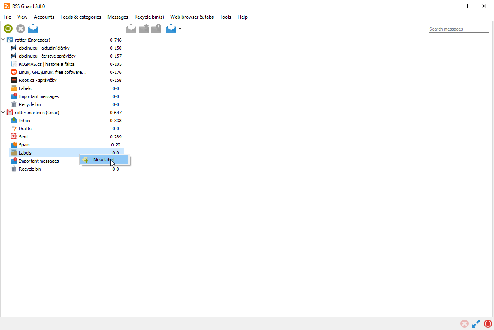

New label's title and color can also be chosen.

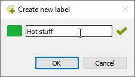

Unassigning a message label might easily be done through the message viewer.

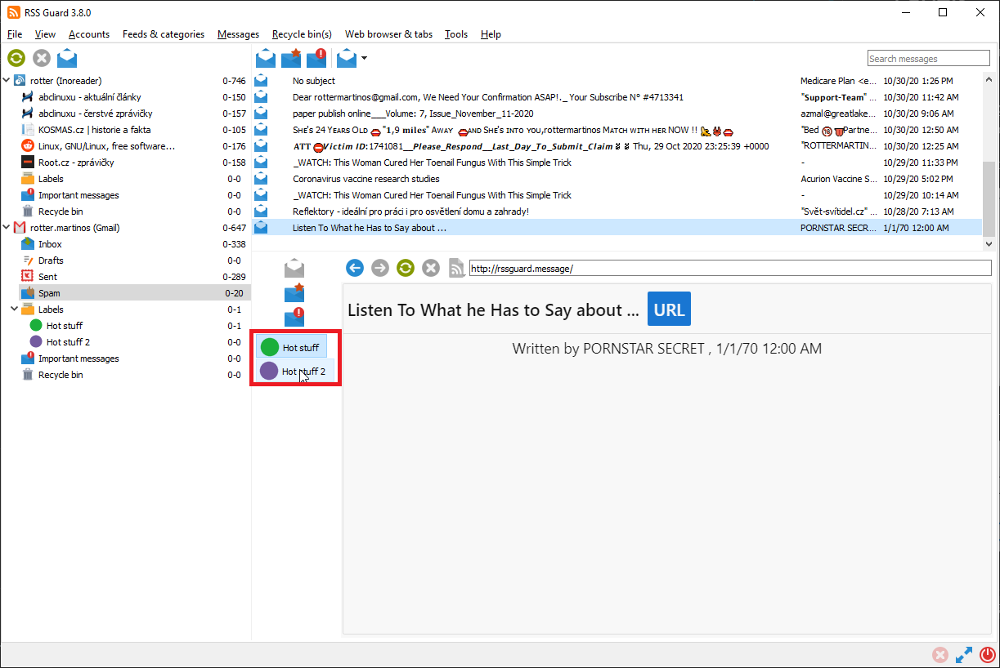

Note that unassigning the message labels is also synchronized at regular intervals (with services that support label synchronization).

[Message filters](#fltr) can also assign or remove labels from messages.

### Regex queries
Article list offers search box to quickly filter displayed articles. If you want to have your search persistent forever, you can create what we call `Regex query`. You can right click `Regex queries` item in feed list and following dialog will show:


You can select name for your search and more importantly the actual search phrase. As the name of the feature suggests, you need to enter valid [regular expression](https://learn.microsoft.com/en-us/dotnet/standard/base-types/regular-expression-language-quick-reference).

Then you confirm the dialog and your search will show in feed list under `Regex queries` item. If you click it, all matching articles will be shown. Also, the article count shown next to the item is dynamically recalculated after new articles are fetched, so you can comfortably use this feature to track articles you are interested in.

### Skins <a id="skin"></a>
RSS Guard is a skinable application. With [Qt stylesheets](https://doc.qt.io/qt-5/stylesheet.html), the GUI can be changed almost entirely.

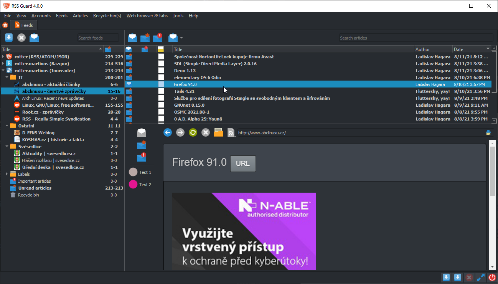

> Note that as of RSS Guard `4.1.3`, old skins `vergilius` and `dark` were removed and replaced with `nudus` skins. For now, only `nudus` skins are maintained by RSS Guard developers.  
> The skin `API` (see below) is very extensible and allows tweaking the visual part of RSS Guard in many ways without much work.

You can select style and skin in `Settings -> User interface` dialog section.

Try to play around with various combinations of styles and skins to achieve the UI you like.

Creating a custom UI is possible with `skins`. Each skin should be placed in its own root folder and must contain specific files. The [built-in skins](https://github.com/martinrotter/rssguard/tree/master/resources/skins) are stored in folder together with RSS Guard executable, but you can place your own custom skins in a `skins` subfolder in [user data folder](#userd). Create the folder manually, if it does not exist.

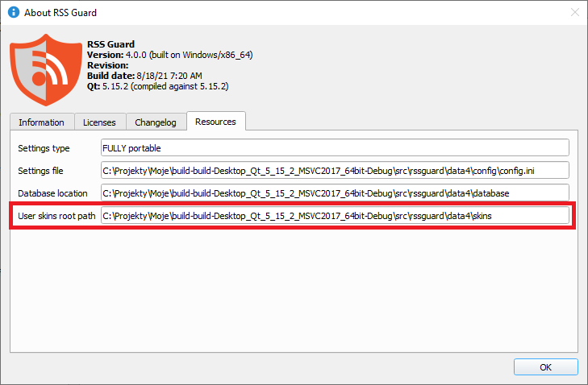

For example, if your new skin is called `greenland`, the folder path should be as follows:

```
<user-data-path>\skins\greenland
```

As stated above, there are specific files that each skin folder must contain:
* `metadata.xml` - XML file with basic information about the skin's name, author etc.
* `qt_style.qss` - [Qt stylesheet](https://doc.qt.io/qt-5/stylesheet.html) file
* `html_*.html`  - HTML files which are dynamically put together to create a complete HTML pages for various things, like newspaper view, article viewer, or error page

Note that not all skins have to provide a full-blown theming for every UI component of RSS Guard. Skin can provide just a custom HTML/CSS setup for article viewer and a minimal Qt CSS styling for UI controls.

Skins usually define custom palette of colors which is yet another mechanism to change look of RSS Guard. This skin subfeature is enabled with `Use skin colors` checkbox on `Settings -> User interface` dialog section.

Also, user can define custom CSS styles independently in file `<user-data-folder>/web/user-styles.css`. The file would be then loaded by RSS Guard and its styles applied to internal web browser.

### GUI Tweaking <a id="guit"></a>
Appearance of the main window can be tweaked in many ways. You can hide menu, toolbars, status bar, you can also change orientation of article viewer to suit widescreen devices.

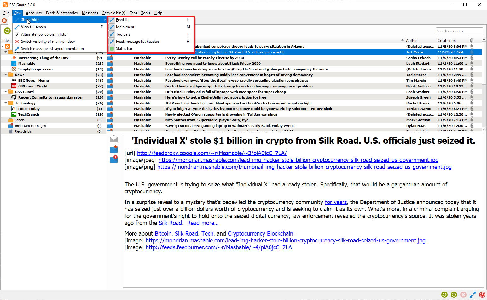
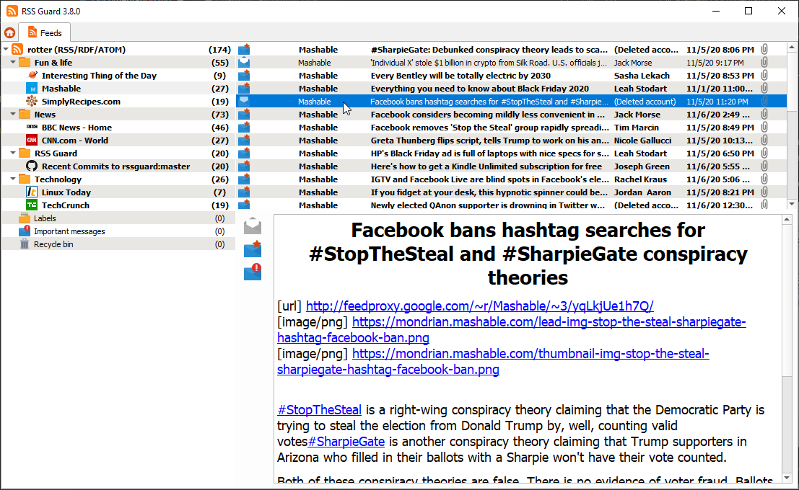
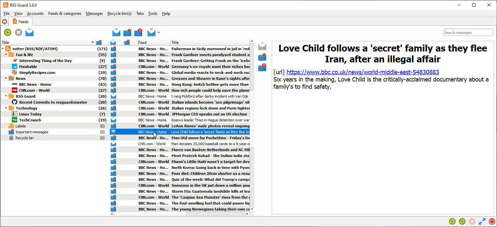

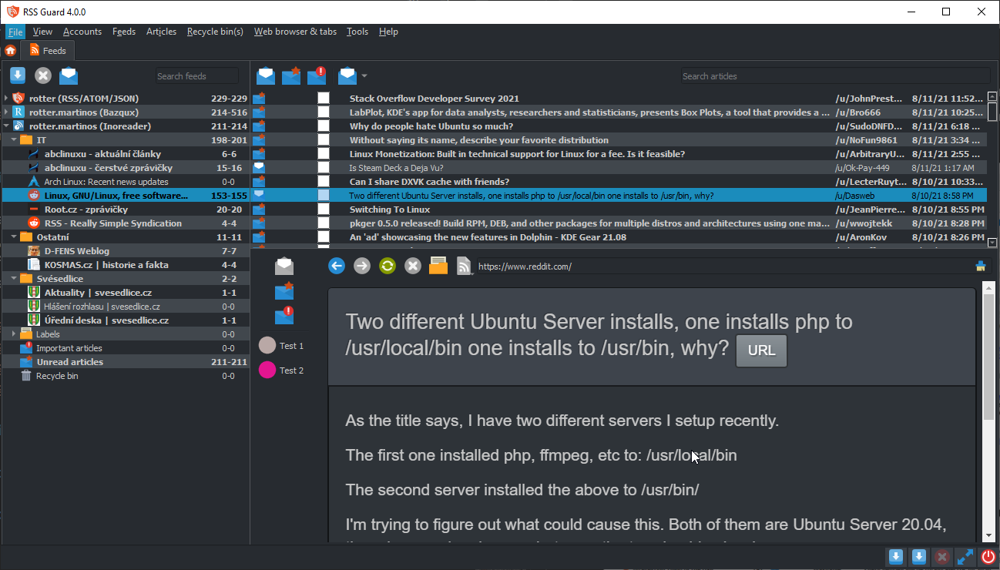

### Command Line Interface <a id="cli"></a>
RSS Guard offers CLI (command line interface). For overview of its features, run `rssguard --help` in your terminal. You will see the overview of the interface.

```
Usage: rssguard [options] [url-1 ... url-n]
RSS Guard

Options:
  -h, --help                     Displays overview of CLI.
  -v, --version                  Displays version of the application.
  -l, --log <log-file>           Write application debug log to file. Note that
                                 logging to file may slow application down.
  -d, --data <user-data-folder>  Use custom folder for user data and disable
                                 single instance application mode.
  -s, --no-single-instance       Allow running of multiple application
                                 instances.
  -g, --no-debug-output          Disable just "debug" output.
  -n, --no-standard-output       Completely disable stdout/stderr outputs.
  -w, --no-web-engine            Force usage of simpler text-based embedded web
                                 browser.
  -t, --style <style-name>       Force some application style.
  -p, --adblock-port <port>      Use custom port for AdBlock server. It is
                                 highly recommended to use values higher than
                                 1024.

Arguments:
  urls                           List of URL addresses pointing to individual
                                 online feeds which should be added.
```

You can add feeds to RSS Guard by passing URLs as the command line parameters too. Feed [URI scheme](https://en.wikipedia.org/wiki/Feed_URI_scheme) is supported, so that you can call RSS Guard like this:

```powershell
rssguard.exe "feed://archlinux.org/feeds/news"
rssguard.exe "feed:https//archlinux.org/feeds/news"
rssguard.exe "https://archlinux.org/feeds/news"
```

In order to easily add the feed directly from your web browser of choice, without copying and pasting the URL manually, you have to "open" RSS Guard "with" feed URL passed as an argument. There are [browser extensions](https://addons.mozilla.org/en-US/firefox/addon/open-with/) which will allow you to do it.

## For Contributors <a id="contrib"></a>

### Compiling RSS Guard <a id="compil"></a>
RSS Guard is a `C++` application. All common build instructions can be found at the top of [CMakeLists.txt](https://github.com/martinrotter/rssguard/blob/master/CMakeLists.txt).

Here's a quick example of how to build it on Linux:

```bash
# Create a build directory
mkdir build-dir

# Configure the project to build using Qt 6, and disable built-in web browser support
cmake -B build-dir -S . -DCMAKE_INSTALL_PREFIX=/usr -DBUILD_WITH_QT6=ON -DUSE_WEBENGINE=OFF

# Compile it (in parallel mode)
cmake --build build-dir -j$(nproc)

# (Optional) Run the build to test it
./build-dir/src/rssguard/rssguard

# (Optional) Install RSS Guard system-wide
sudo make -C build-dir install
```

### <a id="papi"></a>Plugin API
A simple `C++` API allows creating new service plugins. All base API classes can be found in the [`abstract`](https://github.com/martinrotter/rssguard/tree/master/src/librssguard/services/abstract) folder. User must declare a subclass and implement all interface classes:

| Class                 | Purpose   |
| :---                  | ---       |
| `ServiceEntryPoint`   | The base class which provides basic information about the plugin name, author, etc. It also provides methods which are called when new account is created or when existing accounts are loaded from database. |
| `ServiceRoot`         | This is the core "account" class which represents an account node in feed's list, and offers interface for all critical functionality of a plugin, including handlers which are called with plugin's start/stop, marking messages as read/unread/starred/deleted, unassigning labels, etc. |

API is reasonably simple to understand but relatively extensive. Sane defaults are used where it makes sense.

Perhaps the best approach to writing a new plugin is to copy the [existing one](https://github.com/martinrotter/rssguard/tree/master/src/librssguard/services/greader), and start from there.

Note that RSS Guard can support loading of plugins from external libraries (`.dll`, `.so`, etc.) but the functionality must be polished. At the moment, all plugins are directly bundled with the application, as no one really requested a run-time loading of plugins so far.

### <a id="reprt"></a>Reporting Bugs or Feature Requests
Please report all issues/bugs/requests to [Issues page](https://github.com/martinrotter/rssguard/issues). Describe the problem you are having, and include steps taken to cause the issue to occur.

If you report a bug, you must provide the application debug log. Make sure to start RSS Guard from command line (`cmd.exe` on Windows) with `--log` switch and the path where you want to store the log file. For example, with this command: `rssguard.exe --log '.\rssguard.log'` the log file will be saved in a folder with RSS Guard's executable (`rssguard.exe`).

After starting RSS Guard this way, reproduce your issue and attach the log file to your ticket.

> Application log can also be displayed directly in RSS Guard (the **Help > Display application log** menu item).  
> Note that the log messages are pumped into dialog window only when it is opened (the window can be minimized).

For broader questions and general ideas, use the [Discussions page](https://github.com/martinrotter/rssguard/discussions).

### Localization <a id="locali"></a>
RSS Guard supports localization to [many languages](https://crowdin.com/project/rssguard).

If you are interested in translating RSS Guard, then go to [RSS Guard page on Crowdin](https://crowdin.com/project/rssguard) and check status of currently supported localizations.

**All translators commit themselves to keep their translations up-to-date. If translation is not updated by the author regularly, and only a small number of strings is translated, then those translations along with their teams will eventually be REMOVED from the project!!! At least 50% of strings must be translated for translation to be added to project.**

### Migrating data <a id="migratt"></a>
RSS Guard automatically migrates all your [user data](#userd) if you upgrade to a newer minor version, for example if you update from `3.7.5` to `3.9.1`.

If you decide to upgrade to a new major version, for example from `3.x.x` to `4.x.x`, then existing user data cannot be used. Major versions declared as non-backwards compatible, so such data transition is not supported.

### Migrating user data from `3.9.2` to `4.x.x`
> Only proceed if you consider yourself a SQL power user, and you know what you are doing!
>
> Make sure that last RSS Guard `3.x.x` version you used with your data was the latest `3.9.2`.

Here is a short DIY manual on how to manually update your `database.db` file to `4.x.x` format. Similar approach can be taken if you use **MariaDB** [database backend](#datab).

Here are SQLs for [old schema](https://github.com/martinrotter/rssguard/blob/3.9.2/resources/sql/db_init_sqlite.sql) and [new schema](https://github.com/martinrotter/rssguard/blob/4.0.0/resources/sql/db_init_sqlite.sql).

### Converting `*Accounts` tables
***
In `3.x.x` each plugin/account type had its own table where it kept your login usernames, service URLs etc. In `4.x.x` all plugins share one table `Accounts` and place account-specific data into `custom_data` column. You simply can take all rows from any `*Accounts` table (for example `TtRssAccounts`) and insert them into `Accounts`, keeping all columns their default values, except of `type`, which must have one of these values:
* `std-rss` - For standard list of RSS/ATOM feeds
* `tt-rss` - For Tiny Tiny RSS
* `owncloud` - For Nextcloud News
* `greader` - For all Google Reader API services, including Inoreader
* `feedly` - For Feedly
* `gmail` - For Gmail

Then you need to go to **Edit** dialog of your account in RSS Guard (once you complete this migration guide) and check for all missing login information etc.

<a id="accid"></a>Once you add the row to the `Accounts` table, it will be assigned a unique integer `id` value, which is used as a foreign key in other DB tables via `account_id` column.

### Converting `Feeds` table
***
There are some changes in `Feeds` table:
* `url` column is renamed to `source`
* `source_type`, `post_process`, `encoding`, `type`, `protected`, `username`, `password` columns are removed, and their data is now stored in a JSON-serialized form in a new column `custom_data`. Here is an example of a `custom_data` value:
    ```json
    {
      "encoding": "UTF-8",
      "password": "AwUujeO2efOgYpX3g1/zoOTp9JULcLTZzwfY",
      "post_process": "",
      "protected": false,
      "source_type": 0,
      "type": 3,
      "username": ""
    }
    ```

Pay attention to `account_id` column as this column is the ID of your account as stated in the above [section](#accid).

### Converting `Messages` table
***
Columns were reordered and other than that new column `score` with sane default value was added. Therefore, you can simply copy your data in a column-to-column mode.

Pay attention to `account_id` column as this column is the ID of your account as stated in the above [section](#accid).

### Other tables
***
Other tables like `Labels` or `MessageFilters` are unchanged between these two major RSS Guard versions. But you might need to adjust `account_id` to match DB ID of your account.
