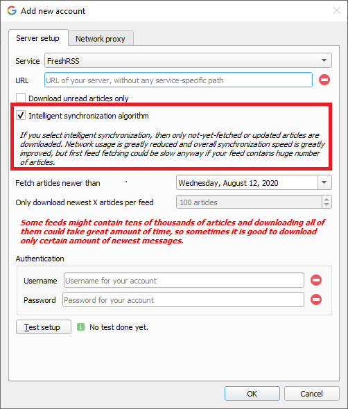
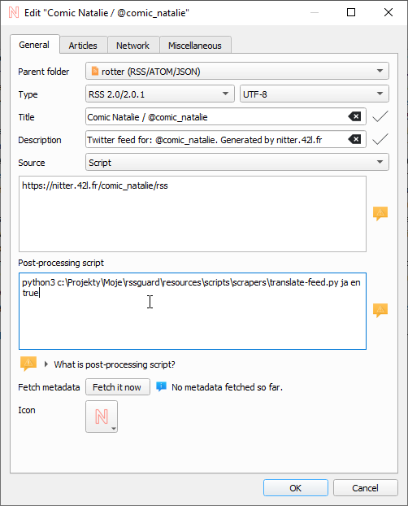
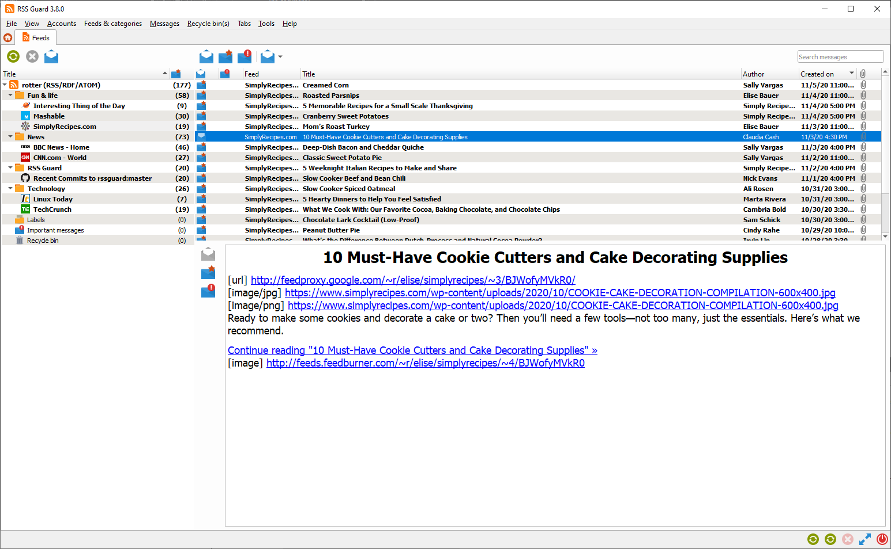

# 🔥 RSS Guard Documentation 🔥

Welcome to RSS Guard documentation. You can find everything about the application right here.

## Table of Contents
### [`What is RSS Guard?`](#wirss)
### [`Downloads`](#dwn)
### [`Supported Operating Systems`](#sos)
### [`Major Features`](#mfe)
##### &nbsp;&nbsp;&nbsp;&nbsp;[`Supported Feed Readers`](#sfr)
##### &nbsp;&nbsp;&nbsp;&nbsp;[`Article Filtering`](#fltr)
##### &nbsp;&nbsp;&nbsp;&nbsp;[`Websites Scraping`](#scrap)
##### &nbsp;&nbsp;&nbsp;&nbsp;[`Notifications`](#notif)
##### &nbsp;&nbsp;&nbsp;&nbsp;[`Database Backends`](#datab)
##### &nbsp;&nbsp;&nbsp;&nbsp;[`User Data Portability`](#userd)
##### &nbsp;&nbsp;&nbsp;&nbsp;[`Built-in Web Browser with AdBlock`](#webb)
### [`Minor Features`]()
##### &nbsp;&nbsp;&nbsp;&nbsp;[`Files Downloader`](#downl)
##### &nbsp;&nbsp;&nbsp;&nbsp;[`Labels`](#lbls)
##### &nbsp;&nbsp;&nbsp;&nbsp;[`Skins`](#skin)
##### &nbsp;&nbsp;&nbsp;&nbsp;[`GUI Tweaking`](#guit)
##### &nbsp;&nbsp;&nbsp;&nbsp;[`Command Line Interface (CLI)`](#cli)
### [`For Contributors`](#contrib)
##### &nbsp;&nbsp;&nbsp;&nbsp;[`Donations`](#donat)
##### &nbsp;&nbsp;&nbsp;&nbsp;[`Compiling RSS Guard`](#compil)
##### &nbsp;&nbsp;&nbsp;&nbsp;[`Plugin API`](#papi)
##### &nbsp;&nbsp;&nbsp;&nbsp;[`Reporting Bugs or Feature Requests`]()
##### &nbsp;&nbsp;&nbsp;&nbsp;[`Localization`]()

<hr style="margin: 40px;"/>

## <a id="wirss"></a>What is RSS Guard?
RSS Guard is desktop [open-source](https://en.wikipedia.org/wiki/Open_source) [cross-platform](#sos) [multi-protocol](#sfr) feed reader. It is able to fetch basically all known feed formats, including RSS/RDF/ATOM/JSON. RSS Guard is developed on top of the [Qt library](http://qt-project.org).

## <a id="dwn"></a>Downloads
Official place to download RSS Guard is at [Github Releases](https://github.com/martinrotter/rssguard/releases). You can also download development (beta) [build](https://github.com/martinrotter/rssguard/releases/tag/devbuild) which is automatically updated everytime source code is updated.

Also, RSS Guard is [available](https://repology.org/project/rssguard/versions) for many Linux distributions, even via [Flathub](https://flathub.org/apps/details/com.github.rssguard).

I highly recommend to download RSS Guard only from reputable sources.

## <a id="sos"></a>Supported Operating Systems
RSS Guard is cross-platform application and at this point is know to work on:
* Windows 7+
* GNU/Linux (including PinePhone and other Linux-based phone operating systems)
* macOS 10.10+
* OS/2 (ArcaOS, eComStation)

## <a id="mfe"></a>Major Features

### <a id="sfr"></a>Supported Feed Readers
RSS Guard is multi-account application and supports many web feed readers via built-in [plugins](#papi). One of the plugins, of course, provides support for standard **RSS/ATOM/JSON** feeds with set of features everyone would expect from classic feed reader like OPML support etc.

I organized supported web feed readers into elegant table.

| Service | Two-way Synchronization | [Intelligent Synchronization Algorithm](#intel) (ISA) <sup>2</sup>  | <a id="sfrl"></a>Synchronized Labels <sup>1</sup> | OAuth |
|----|-----|-----|----|---|
| Feedly | ✅ | ❌ | ✅ | ✅ (only for official binaries) |
| Gmail | ✅ | ❌ | ❌ | ✅ |
| Google Reader API <sup>3</sup> | ✅ | ✅ | ✅ | ✅ (only for Inoreader) |
| Nextcloud News | ✅ | ❌ | ❌ | ❌ |
| Tiny Tiny RSS | ✅ | ❌ | ✅ | ❌ |

<sup>1</sup> Note that [labels](#lbls) are supported for all plugins, it's just that on some plugins they are local-only and are not synchronizeable to/from service, usually because service itself does not support the feature.

<sup>2</sup> <a id="intel"></a> Some plugins support next-gen intelligent synchronization algorithm (ISA) which has some benefits as it usually offers superier synchronization speed and transfers much less data over your network connection.



With ISA, RSS Guard only downloads only articles which are new or were updated, whereas older algorithm in RSS Guard usually always fetches all available articles, even if they are not needed, leading to unnecessary overload of your network connection and RSS Guard.

<sup>3</sup> Tested services are:
* Bazqux
* Reedah
* Inoreader
* TheOldReader
* FreshRSS

### <a id="fltr"></a>Article Filtering
Sometimes you need to tweak incoming article - mark them starred, remove ads from their contents or simply ignore them. That's what filtering feature is for.


#### Writing article filter
Article filters are fully scriptable and consist of arbitrary JavaScript code which must provide function with prototype

```js
function filterMessage() { }
```

The function must be fast and must return values which belong to enumeration [`FilteringAction`](#FilteringAction-enum). You can you use either direct numerical value of each enumerant, for example `2` or you can use self-descriptive name, for example `MessageObject.Ignore`. There are also names `MSG_ACCEPT` and `MSG_IGNORE` as aliases for `MessageObject.Accept` and `MessageObject.Ignore`.

Each message is accessible in your script via global variable named `msg` of type `MessageObject`, see this [file](https://github.com/martinrotter/rssguard/blob/master/src/librssguard/core/messageobject.h) for the declaration. Some properties are writable, allowing you to change contents of the message before it is written to DB. You can mark message important, parse its description or perhaps change author name or even assign some label to it!!!

You can use [special placeholders](#userd-plac) within message filter.

Also, there is a special variable named `utils`. This variable is of type `FilterUtils` and offers some useful utility [functions](#utils-object) for you to use in your filters.

RSS Guard also allows to use list of labels assigned to each message. You can therefore do actions in your filtering script based on which labels are assigned to the message. The property is called `assignedLabels` and is array of [`Label`](#Label-class) objects. If you change assigned labels to the message, then the change will be eventually [synchronized](#sfrl) back to server if respective plugin supports it.

Passed message also offers special function
```js
Boolean MessageObject.isDuplicateWithAttribute(DuplicationAttributeCheck)
```

which allows you to perform runtime check for existence of the message in RSS Guard's database. The parameter is integer value from enumeration [`DuplicationAttributeCheck`](#DuplicationAttributeCheck-enum) and specifies how exactly you want to determine if given message is "duplicate". Again, you can use direct integer values or enumerant names.

For example if you want to check if there is already another message with same author in database, then you call `msg.isDuplicateWithAttribute(MessageObject.SameAuthor)`. Values of the enumeration can be combined via bitwise `|` operation in single call, for example like this: `msg.isDuplicateWithAttribute(MessageObject.SameAuthor | MessageObject.SameUrl)`.

Here is the reference of methods and properties of some types available in your filtering scipts.

#### `MessageObject` class
| Property/method | Description |
|---|---|
| `Array<Label> assignedLabels` | `READ-ONLY` List of labels assigned to the message. |
| `Array<Label> availableLabels` | `READ-ONLY` List of labels which are currently available and can be assigned to the message. Available in RSS Guard 3.8.1+. |
| `String feedCustomId` | `READ-ONLY` Service-specific ID of the feed which this message belongs to. |
| `Number accountId` | `READ-ONLY` RSS Guard's ID of the account activated in the program. This property is highly advanced and you probably do not need to use it at all. |
| `Number id` | `READ-ONLY` ID assigned to the message in RSS Guard local database. |
| `String customId` | `READ-ONLY` ID of the message as provided by the remote service.  |
| `String title` | Title of the message. |
| `String url` | URL of the message. |
| `String author` | Author of the message. |
| `String contents` | Contents of the message. |
| `String rawContents` | This is RAW contents of the message as it was obtained from remote service/feed. You can expect raw `XML` or `JSON` element data here. Note that this attribute has some value only if `alreadyStoredInDb` returns `false`. In other words, this attribute is not persistently stored inside RSS Guard's DB. Also, this attribute is artificially filled with ATOM-like data when testing the filter. |
| `Number score` | Arbitrary number in range <0.0, 100.0>. You can use this number to sort messages in a custom fashion as this attribute also has its own column in messages list. |
| `Date created` | Date/time of the message. |
| `Boolean isRead` | Is message read? |
| `Boolean isImportant` | Is message important? |
| `Boolean isDeleted` | Is message placed in recycle bin? |
| `Boolean isDuplicateWithAttribute(DuplicationAttributeCheck)` | Allows you to test if this particular message is already stored in RSS Guard's DB. |
| `Boolean assignLabel(String)` | Assigns label to this message. The passed `String` value is the `customId` property of `Label` type. See its API reference for relevant info. |
| `Boolean deassignLabel(String)` | Removes label from this message. The passed `String` value is the `customId` property of `Label` type. See its API reference for relevant info. |
| `Boolean runningFilterWhenFetching` | `READ-ONLY` Returns `true` if current run of the message filter is done when message is fetched. Returns `false` if message filter runs manually, for example from `Article filters` window. |

#### `Label` class
| Property/method | Description |
|---|---|
| `String title` | `READ-ONLY` Label title. |
| `String customId` | `READ-ONLY` Service-specific ID of this label. This ID is used as unique identifier for the label and is particularly useful if you want to (de)assign label to/from message. |
| `color color` | `READ-ONLY` Label color. Note that type `color` has its documentation [here](https://doc.qt.io/qt-5/qml-color.html). |

#### `FilteringAction` enum
| Enumerant name | Integer value | Description |
|---|---|---|
| `Accept` | 1 | Message is accepted and will be added to DB or updated in DB. |
| `Ignore` | 2 | Message is ignored and will be **NOT** added to DB or updated in DB, but is not purged from DB if already exists. |
| `Purge` | 4 | Existing message is purged from the DB completely. Behavior is the same as `Ignore` when there is new incoming message. |

Note that `MessageObject` attributes which can be synchronized back to service are synchronized even if you return `Purge` or `Ignore`. In other words: even if your filter ignores the message you can still tweak its properties which will get synchronized back to your server.

#### `DuplicationAttributeCheck` enum
| Enumerant name | Integer value | Description |
|---|---|---|
| `SameTitle` | 1 | Check if message has same title as some another messages. |
| `SameUrl` | 2 | Check if message has same URL as some another messages. |
| `SameAuthor` | 4 | Check if message has same author as some another messages. |
| `SameDateCreated` | 8 | Check if message has same date of creation as some another messages. |
| `AllFeedsSameAccount` | 16 | Perform the check across all feeds from your account, not just "current" feed. |

#### `utils` object
| Method | How to call | Description |
|---|---|---|
| `String hostname()` | `utils.hostname()` | Returns name of your PC. |
| `String fromXmlToJson(String)` | `utils.fromXmlToJson('<h1>hello</h1>')` | Converts `XML` string into `JSON`. |
| `Date parseDateTime(String)` | `utils.parseDateTime('2020-02-24T08:00:00')` | Converts textual date/time representation into proper `Date` object. |

#### Examples
Accept only messages from "Bob" while also marking them important.
```js
function filterMessage() {
  if (msg.author == "Bob") {
    msg.isImportant = true;
    return MessageObject.Accept;
  }
  else {
    return MessageObject.Ignore;
  }
}
```

Replace all dogs with cats!
```js
function filterMessage() {
  msg.title = msg.title.replace("dogs", "cats");
  return MessageObject.Accept;
}
```

Use published element instead of updated element for ATOM entries (only).
```js
function filterMessage() {
  // Read raw contents of message and
  // convert to JSON.
  json = utils.fromXmlToJson(msg.rawContents);
  jsonObj = JSON.parse(json)
  
  // Read published date and parse it.
  publishedDate = jsonObj.entry.published.__text;
  parsedDate = utils.parseDateTime(publishedDate);

  // Set new date/time for message and
  // proceed.
  msg.created = parsedDate;
  return MessageObject.Accept;
}
```

Dump RAW data of each message to RSS Guard's [debug output](Documentation.md#generating-debug-log-file).
```js
function filterMessage() {
  console.log(msg.rawContents);
  return MessageObject.Accept;
}
```

The above script produces this kind of debug output when running for Tiny Tiny RSS.
```
...
...
time="    34.360" type="debug" -> feed-downloader: Hooking message took 4 microseconds.
time="    34.361" type="debug" -> {"always_display_attachments":false,"attachments":[],"author":"Aleš Kapica","comments_count":0,"comments_link":"","content":"<p>\nNaposledy jsem psal o čuňačení v MediaWiki asi před půl rokem, kdy jsem chtěl upozornit na to, že jsem přepracoval svoji původní šablonu Images tak, aby bylo možné používat výřezy z obrázků a stránek generovaných z DjVu a PDF dokumentů. Blogpost nebyl nijak extra hodnocen, takže mě vcelku nepřekvapuje, jak se do hlavní vývojové větve MediaWiki dostávají čím dál větší prasečiny.\n</p>","feed_id":"5903","feed_title":"abclinuxu - blogy","flavor_image":"","flavor_stream":"","guid":"{\"ver\":2,\"uid\":\"52\",\"hash\":\"SHA1:5b49e4d8f612984889ba25e7834e80604c795ff8\"}","id":6958843,"is_updated":false,"labels":[],"lang":"","link":"http://www.abclinuxu.cz/blog/kenyho_stesky/2021/1/cunacime-v-mediawiki-responzivni-obsah-ii","marked":false,"note":null,"published":false,"score":0,"tags":[""],"title":"Čuňačíme v MediaWiki - responzivní obsah II.","unread":true,"updated":1610044674}
time="    34.361" type="debug" -> feed-downloader: Running filter script, it took 348 microseconds.
time="    34.361" type="debug" -> feed-downloader: Hooking message took 4 microseconds.
time="    34.361" type="debug" -> {"always_display_attachments":false,"attachments":[],"author":"kol-ouch","comments_count":0,"comments_link":"","content":"Ahoj, 1. 6. se blíží, tak začínám řešit co s bambilionem fotek na google photos. \n<p class=\"separator\"></p>\nZa sebe můžu říct, že gp mi vyhovují - ne snad úplně tím, že jsou zadarmo, ale hlavně způsobem práce s fotkami, možnostmi vyhledávání v nich podle obsahu, vykopírování textu z nich, provázaností s mapami, recenzemi, možnostmi sdílení, automatickým seskupováním a podobně.","feed_id":"5903","feed_title":"abclinuxu - blogy","flavor_image":"","flavor_stream":"","guid":"{\"ver\":2,\"uid\":\"52\",\"hash\":\"SHA1:1277107408b159882b95ca7151a0ec0160a3971a\"}","id":6939327,"is_updated":false,"labels":[],"lang":"","link":"http://www.abclinuxu.cz/blog/Co_to_je/2021/1/kam-s-fotkama","marked":false,"note":null,"published":false,"score":0,"tags":[""],"title":"Kam s fotkama?","unread":true,"updated":1609750800}
...
...
```

For RSS 2.0 message, the result might look like this.
```
...
...
time="     3.568" type="debug" -> feed-downloader: Hooking message took 6 microseconds.
time="     3.568" type="debug" -> <item>
<title><![CDATA[Man Utd's Cavani 'not comfortable' in England, says father]]></title>
<description><![CDATA[Manchester United striker Edinson Cavani "does not feel comfortable" and could move back to his native South America, his father said.]]></description>
<link>https://www.bbc.co.uk/sport/football/56341983</link>
<guid isPermaLink="true">https://www.bbc.co.uk/sport/football/56341983</guid>
<pubDate>Tue, 09 Mar 2021 23:46:03 GMT</pubDate>
</item>

time="     3.568" type="debug" -> feed-downloader: Running filter script, it took 416 microseconds.
```

Write details of available labels and assign the first label to the message.
```js
function filterMessage() {
  console.log('Number of assigned labels: ' + msg.assignedLabels.length);
  console.log('Number of available labels: ' + msg.availableLabels.length);

  var i;
  for (i = 0; i < msg.availableLabels.length; i++) {
    var lbl = msg.availableLabels[i];

    console.log('Available label:');
    console.log('  Title: \'' + lbl.title + '\' ID: \'' + lbl.customId + '\'');
  }

  if (msg.availableLabels.length > 0) {
    console.log('Assigning first label to message...');
    msg.assignLabel(msg.availableLabels[0].customId);

    console.log('Number of assigned labels ' + msg.assignedLabels.length);
  }

  console.log();
  return MessageObject.Accept;
}
```

Make sure that your receive only one message with particular URL across all your feeds (from same plugin) and all other messages with same URL are subsequently ignored.
```js
function filterMessage() {
  if (msg.isDuplicateWithAttribute(MessageObject.SameUrl | MessageObject.AllFeedsSameAccount)) {
    return MessageObject.Ignore;
  }
  else {
    return MessageObject.Accept;
  }
}
```

Remove "ads" from messages received from Inoreader. Method simply removes `div` which contains the advertisement.
```js
function filterMessage() {
  msg.contents = msg.contents.replace(/<div>\s*Ads[\S\s]+Remove<\/a>[\S\s]+adv\/www\/delivery[\S\s]+?<\/div>/im, '');

  return MessageObject.Accept;
}
```

### <a id="scrap"></a>Websites Scraping
> **Only proceed if you consider yourself to be a power user and you know what you are doing!**

RSS Guard offers extra advanced features which are inspired by [Liferea](https://lzone.de/liferea/).

You can select source type of each feed. If you select `URL`, then RSS Guard simply downloads feed file from given location and behaves like everyone would expect.

However, if you choose `Script` option, then you cannot provide URL of your feed and you rely on custom script to generate feed file and provide its contents to **standard output**. Resulting data written to standard output should be valid feed file, for example RSS or ATOM XML file.

`Fetch it now` button also works with `Script` option. Therefore, if your source script and (optional) post-process script in cooperation deliver a valid feed file to the output, then all important metadata, like title or icon of the feed, can be automagically discovered.


Any errors in your script must be written to **error output**.

Note that you must provide full execution line to your custom script, including interpreter binary path and name and all that must be written in special format `<interpreter>#<argument1>#<argument2>#....`. The `#` character is there to separate interpreter and individual arguments. I had to select some character as separator because simply using space ` ` is not that easy as it might sound, as sometimes space could be a part of an argument itself.

Used script must return `0` as process exit code if everything went well, or non-zero exit code if some error happened.

Binary name (interpreter) must be provided in all cases, arguments do not have to be. Also be very carefully about arguments quoting. Some examples of valid and tested execution lines are:
 
| Command | Explanation |
|---------|-------------|
| `bash#-c#curl https://github.com/martinrotter.atom` | Downloads ATOM feed file with Bash and Curl. |
| `Powershell#Invoke-WebRequest 'https://github.com/martinrotter.atom' \| Select-Object -ExpandProperty Content` | Downloads ATOM feed file with Powershell. |
| `php#tweeper.php#-v#0#https://twitter.com/NSACareers` | Scrape Twitter RSS feed file with [Tweeper](https://git.ao2.it/tweeper.git). Tweeper is utility which is able to produce RSS feed from Twitter and other similar social platforms. |



Note that the above examples are cross-platform and you can use the exact same command on Windows, Linux or Mac OS X, if your operating system is properly configured.

RSS Guard offers [placeholder](#userd-plac) `%data%` which is automatically replaced with full path to RSS Guard's [user data folder](#userd), allowing you to make your configuration fully portable. You can, therefore, use something like this as source script line: `bash#%data%/scripts/download-feed.sh`.

Also, working directory of process executing the script is set to point to RSS Guard's user data folder.

There are some examples of website scrapers [here](https://github.com/martinrotter/rssguard/tree/master/resources/scripts/scrapers), most of them are written in Python 3, thus their execution line is similar to `python#script.py`. Make sure to examine each script for more information on how to use it.

After your source feed data are downloaded either via URL or custom script, you can optionally post-process the data with one more custom script, which will take **raw source data as input** and must produce processed valid feed data to **standard output** while printing all error messages to **error output**.

Format of post-process script execution line is the same as above.


Typical post-processing filter might do things like advanced CSS formatting, localization of content to another language, downloading of full articles, some kind of filtering or removing ads.

It's completely up to you if you decide to only use script as `Source` of the script or separate your custom functionality between `Source` script and `Post-process` script. Sometimes you might need different `Source` scripts for different online sources and the same `Post-process` script and vice versa.

### <a id="notif"></a>Notifications
RSS Guard allows you to configure behavior of desktop notifications. There is a number of events which can be configured:
* new (unread) messages downloaded,
* downloading of messages started,
* login OAuth tokens refreshed,
* new RSS Guard version available,
* ...


Your notification can also play `.wav` sounds which you can place under your [user data folder](#userd) and use them via special [placeholder](#userd-plac). Other audio formats are not supported.

### <a id="datab"></a>Database Backends
RSS Guard offers switchable database backends which hold your data. At this point, two backends are available:
* MariaDB,
* SQLite (default).

SQLite backend is very simple to use, no further configuration is needed and all your data is stored in single file
```
<user-data-root-folder>\database\local\database.db
```
Check `About RSS Guard -> Resources` dialog to find more info on significant paths used. This backend offers "in-memory" database option, which automatically copies all your data into RAM when app starts and then works solely with that RAM data, which makes RSS Guard incredibly fast. Data is also written back to database file when app exits. Note that this option should be used very rarely because RSS Guard should be fast enough with classic SQLite persistent DB files. So only use this if your amounts of article data are huge and you know what you are doing.

MariaDB (MySQL) backend is there for users, who want to store their data in a centralized way. You can have single server in your network and use multiple RSS Guard instances to access the data.

For database-related configuration see `Settings -> Data storage` dialog.

### <a id="userd"></a>User Data Portability
One of the main goals of RSS Guard is to have local application data portable (relocatable) so that they can be use across all [supported operating systems](#sos).

RSS Guard is able to run in two modes.

Default mode is *"non-portable"* mode, where user data folder is placed in user-wide "config directory" (this is `C:\Users\<user>\AppData\Local` on Windows). If subfolder with file
```
RSS Guard 4\data\config\config.ini
```
exists, then this user folder is used.

The other mode is that user data folder is placed in subfolder `data4` in the same directory as RSS Guard binary (`rssguard.exe` on Windows). This *"portable"* mode is automatically enabled if "non-portable" mode detection fails.

#### <a id="userd-plac"></a>`%data%` placeholder
RSS Guard stores its data and settings in single folder. What exact folder it is is described [here](#portable-user-data). RSS Guard allows you to use the folder programmatically in some special contexts via `%data%` placeholder. You can use this placeholder in these RSS Guard contexts:
* Contents of your [message filters](Message-filters.md) - you can therefore place some scripts under your user data folder and include it via `JavaScript` into your message filter.
* Contents of each file included in your custom [skins](#skin). Note that in this case, the semantics of `%data%` are little changed and `%data%` points directly to base folder of your skin.
* `source` and `post-process script` attributes of for [scraping](#scrap) feed - you can use the placeholder to load scripts to generate/process feed from user data folder.
* Notifications also support the placeholder in path to audio files which are to be played when some event happens. For example you could place audio files in your data folder and then use them in notification with `%data%\audio\new-messages.wav`. See more about notifications [here](#notif).

### <a id="webb"></a>Built-in Web Browser with AdBlock
RSS Guard is distributed in two variants:
* **Standard package with WebEngine-based bundled message viewer**: This variant displays messages with their full formatting and layout in embedded Chromium-based web viewer. This variant of RSS Guard should be nice for everyone. Also, installation packages are relatively big.


* **Lite package with simple text-based message viewer**: This variant displays message in much simpler and more lightweight text-based component. All packages of this variant have `nowebengine` keyword in their names. Layout and formatting of displayed message is simplified, no big external web viewers are used, which results in much smaller installation packages, much smaller memory footprint and increased privacy of the user, because many web resources are not downloaded by default like pictures, JavaScript and so on. This variant of RSS Guard is meant for advanced users.



If you're not sure which version to use, **use the WebEngine-based RSS Guard**.

#### AdBlock
[Web-based variant](#webb) of RSS Guard offers ad-blocking functionality via [Adblocker](https://github.com/cliqz-oss/adblocker). Adblocker offers similar performance to [uBlock Origin](https://github.com/gorhill/uBlock).

You need to have have [Node.js](https://nodejs.org) with [NPM](https://www.npmjs.com) (which is usually included in Node.js installer) installed to have ad-blocking in RSS Guard working. Also, the implementation requires additional [npm](https://www.npmjs.com) modules to be installed. You see that list of needed modules near the top of [this](https://github.com/martinrotter/rssguard/blob/master/resources/scripts/adblock/adblock-server.js) file.

I understand that the above installation of needed dependencies is not trivial, but it is necessary evil to have up-to-date and modern implementation of AdBlock in RSS Guard. Previous `C++`-based implementation was buggy, quite slow and hard to maintain.

You can find elaborated lists of AdBlock rules [here](https://easylist.to). You can just copy direct hyperlinks to those lists and paste them into "Filter lists" textbox as seen below. Remember to always separate individual links with newlines. Same applies to "Custom filters" where you can insert individual filters, for example [filter](https://adblockplus.org/filter-cheatsheet) "idnes" to block all URLs with "idnes" in them.


The way ad-blocking internally works is that RSS Guard starts local HTTP browser which provides ad-blocking API, which is subsequently called by RSS Guard. There is some caching done in between, which speeds up some ad-blocking decisions.

## Minor Features

### <a id="downl"></a>Files Downloader
RSS Guard offers simple embedded file downloader.


You can right click on any item in embedded web browser and hit `Save as` button. RSS Guard will then automatically display downloader and will download your file. This feature works in both RSS Guard [variants](#webb).


You can download up to 6 files simultaneously.

### <a id="lbls"></a>Labels
RSS Guard supports labels (tags). Arbitrary number of tags can be assigned to each and every message.

Also, note that tags in some plugins are [synchronizable](#sfrl). While labels are synchronized with these services, they sometimes cannot be directly created via RSS Guard and you have to create them via web interface of the respective service and then perform `Synchronize folders & other items` which will download newly created labels too.

You can easily add labels via `Labels` root item.


You can choose title and color of your new label.


You can easily (de)assign label to messages in message viewer.


Note that (de)assignments of labels to messages are synchronized back to supported servers in regular intervals.

Also, [message filters](#fltr) can assign or remove labels to/from messages.

### <a id="skin"></a>Skins
RSS Guard is skinable application. Its GUI can be almost completely styled with [stylesheets](https://doc.qt.io/qt-5/stylesheet.html).


You can select style and skin in settings category `User interface`.

RSS Guard encapsulates styling capabilities via *skins* feature. Each skin is placed in its own folder and must contain several [files](https://github.com/martinrotter/rssguard/tree/master/resources/skins/vergilius). There are some [built-in](https://github.com/martinrotter/rssguard/tree/master/resources/skins) skins, but you can place your custom skins in your [user data folder](#userd). You can find exact path to your user data folder in `About` dialog. Note that there must be subfolder `skins`. Create it if it does not exist and place your custom skins inside.


So for example if your new skin is called `greenland`, you must place it in folder

```
<user-data-path>\skins\greenland
```

As stated above, there are several files in each skin:
* `metadata.xml` - XML file with some basic information about the skin's name, author etc. Also,
* `theme.css` - [Qt stylesheet](https://doc.qt.io/qt-5/stylesheet.html) file.
* `html_*.html` - These are (partial) HTML files which are used by RSS Guard in various situations like displaying article or error page.

### <a id="guit"></a>GUI Tweaking
RSS Guard's main window appearance can be tweaked in many ways. You can hide menu, toolbars, status bar, you can also change orientation of article viewer to suit widescreen devices.


### <a id="cli"></a>Command Line Interface
RSS Guard offers CLI (command line interface). For overview of its features, run `rssguard --help` in your terminal. You will see the overview of the interface.

```
rssguard [options] [url-1 ... url-n]

Options:
  -l, --log <log-file>           Write application debug log to file. Note that
                                 logging to file may slow application down.
  -d, --data <user-data-folder>  Use custom folder for user data and disable
                                 single instance application mode.
  -s, --no-single-instance       Allow running of multiple application
                                 instances.
  -n, --no-debug-output          Completely disable stdout/stderr outputs.
  -?, -h, --help                 Displays help on commandline options.
  --help-all                     Displays help including Qt specific options.
  -v, --version                  Displays version information.

Arguments:
  urls                           List of URL addresses pointing to individual
                                 online feeds which should be added.
```

RSS Guard can add feeds passed as URLs via command line arguments. Feed URI [scheme](https://en.wikipedia.org/wiki/Feed_URI_scheme) is supported, so that you can call RSS Guard like this:

```
rssguard.exe "feed://archlinux.org/feeds/news"
rssguard.exe "feed:https//archlinux.org/feeds/news"
rssguard.exe "https://archlinux.org/feeds/news"
```

So in order to comfortably add feed directly to RSS Guard from you browser without copying its URL manually, you have to "open" RSS Guard "with" feed URL passed as parameter. There are [extensions](https://addons.mozilla.org/en-GB/firefox/addon/open-with/) which can do it.

## <a id="contrib"></a>For Contributors

### <a id="donat"></a>Donations
You can support author of RSS Guard via [donations](https://github.com/sponsors/martinrotter).

### <a id="compil"></a>Compiling RSS Guard
RSS Guard is C++ application and all common build instructions can be found in top of [project file](https://github.com/martinrotter/rssguard/blob/master/build.pro).

### <a id="papi"></a>Plugin API
RSS Guard offers simple `C++` API for creating new service plugins. All base API classes are in folder [`abstract`](https://github.com/martinrotter/rssguard/tree/master/src/librssguard/services/abstract). User must subclass and implement all interface classes:

| Class | Purpose |
|-------|---------|
| `ServiceEntryPoint` | Very base class which provides basic information about the plugin name, author etc. It also provides methods which are called when new account should be created and when existing accounts should be loaded from database. |
| `ServiceRoot` | This is the core "account" class which represents account node in feed's list and offers interface for all critical functionality of a plugin, including handlers which are called when starting/stoping a plugin, marking messages read/unread/starred/deleted, (de)assigning labels etc. |

API is reasonably simple to understand but relatively large. Sane default behavior is employed where it makes sense.

Perhaps the best approach to use when writing new plugin is to copy [existing](https://github.com/martinrotter/rssguard/tree/master/src/librssguard/services/greader) one and start from there.

Note that RSS Guard can support loading of plugins from external libraries (dll, so, etc.) but the functionality must be polished because so far all plugins are directly bundled into the app as no one really requested run-time loading of plugins so far.

### Reporting Bugs or Feature Requests
Please report all issues/bugs/ideas to [Issues](https://github.com/martinrotter/rssguard/issues) section. Describe your problem as precisely as possible, along with steps taken leading up to the issue occurring.

Also, for some broader questions or general ideas, use [discussions](https://github.com/martinrotter/rssguard/discussions) rather than [issues](https://github.com/martinrotter/rssguard/issues).

### Localization
RSS Guard currently includes [many localizations](http://www.transifex.com/projects/p/rssguard).

If you are interested in creating translations for RSS Guard, then do this:

1. Go [here](http://www.transifex.com/projects/p/rssguard) and check status of currently supported localizations.
2. [Login](http://www.transifex.com/signin) (you can use social networks to login) and work on existing translations. If no translation team for your country/language exists, then ask for creating of localization team via the website.

**All translators commit themselves to keep their translations up-to-date. If some translations are not updated by their authors regularly and only small number of strings is translated, then those translations along with their teams will be eventually REMOVED from the project!!! At least 50% of strings must be translated for translation to being added to project.**
