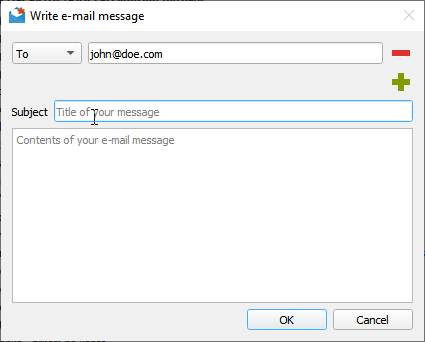
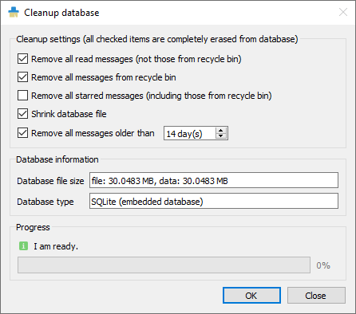

# Documentation
* [Introduction](#introduction)
    * [Downloads](Downloads.md)
    * [Philosophy](#philosophy)
    * [Versioning](#versioning)
    * [Reporting bugs](#reporting-bugs)
    * [Localizations](#localizations)
    * [Web-based and lite app variants](#web-based-and-lite-app-variants)
* [Features](#features)
    * [List of main features](#list-of-main-features)
    * [Supported feed formats and online feed services](Feed-formats.md)
    * [Message filtering](Message-filters.md)
    * [Database backends](#database-backends)
    * [Gmail](#gmail)
    * [Labels](Labels.md)
    * [Downloading files](#downloading-files)
    * [AdBlock](#adblock)
    * [GUI tweaking](#gui-tweaking)
* [Miscellaneous](#miscellaneous)
    * [Command line interface](#cli)
    * [Cleaning database](#cleaning-database)
    * [Portable user data](#portable-user-data)
    * [Downloading new messages](#downloading-new-messages)
    * [Generating debug log file](#generating-debug-log-file)


# Introduction
First, let me say, that you can contact RSS Guard's lead developer via [e-mail](mailto:rotter.martinos@gmail.com) or just submit a ticket here in the repository.

I am glad to accept any kind of donations, see ♥ **Sponsor** button on the top of this page. **I say "thank you" for all your support, my donators.** Also, I personally send "thank you" to all contributors (translators, source code contributors, issue reporters) and users.

Note that some more elaborate parts of this documentation are placed in separate files for practical purposes.

## Philosophy
RSS Guard tends to be independent software. It's free, it's open-source. RSS Guard accepts donations but only as a way of saying "thank you for RSS Guard".

## Versioning
RSS Guard uses [semantic versioning](https://semver.org/). The versioning scheme is `X.Y.Z`, where:

* `X` marks major release version. This number will change very rarely and indicates critical new changes breaking backward compatibility.
* `Y` indicates that there is new major feature available.
* `Z` indicates that there are newly fixed bugs or small features introduced.

## Reporting bugs
Please report all issues/bugs/ideas to [Issues](https://github.com/martinrotter/rssguard/issues) section. Describe your problem as precisely as possible, along with steps taken leading up to the issue occurring.

It is a good idea to read [this](http://www.chiark.greenend.org.uk/~sgtatham/bugs.html) before reporting the bug; it will save time and effort for everyone if all the required information is provided from the get-go.

## Localizations
RSS Guard currently includes [many localizations](http://www.transifex.com/projects/p/rssguard).

If you are interested in creating translations for RSS Guard, then do this:

1. Go [here](http://www.transifex.com/projects/p/rssguard) and check status of currently supported localizations.
2. [Login](http://www.transifex.com/signin) (you can use social networks to login) and work on existing translations. If no translation team for your country/language exists, then ask for creating of localization team via the website.

**All translators commit themselves to keep their translations up-to-date. If some translations are not updated by their authors regularly and only small number of strings is translated, then those translations along with their teams will be eventually REMOVED from the project!!! At least 50% of strings must be translated for translation to being added to project.**

## Web-based and lite app variants
RSS Guard is distributed in two variants:
* **Standard package with WebEngine-based bundled message viewer**: This variant displays messages with their full formatting and layout in embedded Chromium-based web viewer. This variant of RSS Guard should be nice for everyone who doesn't care about memory consumption. Also, installation packages are relatively big.


* **Lite package with simple text-based message viewer**: This variant displays message in much simpler and more lightweight text-based component. Layout and formatting of displayed message is simplified, no big external web viewers are used, which results in much smaller installation packages, much smaller memory footprint and increased privacy of the user, because many web resources are not downloaded by default like pictures, JavaScript and so on. This variant of RSS Guard is meant for advanced users and offers faster GUI response in some use-cases.


If you're not sure which version to use, **use the WebEngine-based RSS Guard**.

# Features
RSS Guard is simple (yet powerful) feed reader. It is able to fetch the most known feed formats, including RSS/RDF/ATOM/JSON. RSS Guard is developed on top of the [Qt library](http://qt-project.org) and it supports these operating systems:

* Windows Vista and newer,
* GNU/Linux,
* Mac OS X,
* Android (buildable and running).

## List of main features
* **support for online feed synchronization via plugins**,
    * Tiny Tiny RSS (RSS Guard 3.0.0+),
    * Nextcloud News (RSS Guard 3.1.0+),
    * Inoreader (RSS Guard 3.5.0+),
    * Gmail with e-mail sending (RSS Guard 3.7.1+).
* core:
    * support for all feed formats (RSS/RDF/ATOM/JSON),
    * full support of podcasts (RSS/ATOM/JSON),
    * import/export of feeds to/from OPML 2.0,
    * possibility of using custom 3rd-party feed synchronization services,
    * feed metadata fetching including icons,
    * simple internal Chromium-based web viewer (or alternative version with simpler and much more lightweight internal viewer),
    * scriptable [message filtering](#message-filtering),
    * downloader with own tab and support for up to 6 parallel downloads,
    * ability to cleanup internal message database with various options,
    * enhanced feed auto-updating with separate time intervals,
    * "portable" mode support with clever auto-detection,
    * feed categorization,
    * feed authentication (BASIC),
    * handles tons of messages & feeds,
    * ability to backup/restore database or settings,
    * fully-featured recycle bin,
    * multiple data backend support,
        * SQLite (in-memory DBs too),
        * MySQL.
    * ability to specify target database by its name (MySQL backend),
    * support for `feed://` URI scheme.
* user interface:
    * message list filter with regular expressions,
    * drag-n-drop for feed list,
    * able to show unread feeds/messages only,
    * can be controlled via keyboard,
    * fully adjustable toolbars (changeable buttons and style),
    * hideable main menu, toolbars and list headers,
    * bundled icon themes (Numix & Papirus),
    * fully skinable user interface + ability to create your own skins,
    * newspaper view,
    * tabbed interface,
    * ability to hide list of feeds/categories,
    * desktop integration via tray icon,
    * localizations to some languages,
    * ability to tweak columns in displayed list of messages.

## Database backends
RSS Guard offers switchable database backends which hold your data. At this point, two backends are available:
* MariaDB,
* SQLite (default).

SQLite backend is very simple to use, no further configuration is needed and all your data are stored in single file
```
<user-data-root-path>\database\local\database.ini
```
Check `About RSS Guard -> Resources` dialog to find more info on significant paths used. This backend offers "in-memory" database option, which automatically copies all your data into RAM when app starts and then works solely with that RAM data, which makes RSS Guard incredibily fast. Data is also stored back to database file when app exits. Note that this option should be used very rarely because RSS Guard should be fast enought with classic SQLite persistent DB files.

MariaDB (MySQL) backend is there for users, who want to store their data in a centralized way. You can have single server in your (local) network and use multiple RSS Guard instances to access the data. MySQL will also work much better if you prefer to have zillions of feeds and messages stored.

For database-related configuration see `Settings -> Data storage` dialog.

## Gmail
RSS Guard includes Gmail plugin, which allows users to receive and send (!!!) e-mail messages. Plugin uses [Gmail API](https://developers.google.com/gmail/api) and offers some e-mail client-like features:
* Sending e-mail messages.



* You can also reply to existing messages.
* Plugin is able to suggest recipient's e-mail. Suggestable addresses are read from e-mail messages which are already stored in RSS Guard's database. Therefore you have to have some e-mails fetched in order to have this feature working.

## Downloading files
RSS Guard offers simple embedded file downloader.


You can right click on any item in embedded web browser and hit `Save as` button. RSS Guard will then automatically display downloader and will download your file. This feature works in both RSS Guard [variants](#web-based-and-lite-app-variants).


You can download up to 6 files simultaneously.

## AdBlock
[Web-based variant](#web-based-and-lite-app-variants) of RSS Guard offers ad-blocking functionality too.

You can find its settings in `Web browser & tabs` section of main menu.

## GUI tweaking
RSS Guard's GUI is very customizable. You can, for example, hide many GUI elements.


For example, you can hide menu, toolbars, status bar and even list headers to achieve very minimal main window layout.

If you hide main menu, then small `home` icon will appear in left-top corner of main application window. 


Many people have very widescreen monitors nowadays and RSS Guard offers you horizontal layout for this use case, placing message previewer on the right side of message list.


# Miscellaneous
Here you can find some useful insights into RSS Guard's modus operandi.

## CLI
RSS Guard offers CLI (command line interface). For overview if its features, run `rssguard --help` in your terminal. You will see the overview of the interface.

```
RSS Guard

Options:
  -l, --log <log-file>  Write application debug log to file.
  -?, -h, --help        Displays help on commandline options.
  --help-all            Displays help including Qt specific options.
  -v, --version         Displays version information.
```

## Cleaning database
Your RSS Guard's database can grow really big over time, therefore you might need to do its cleanup regularly. There is a dialog `Cleanup database` in `Tools` menu to do just that for you, but note that RSS Guard should run just fine even with thousands of messages.



## Portable user data
RSS Guard checks "config directory" (this is `C:\Users\<user>\AppData\Local` directory on Windows) for existence of file:
```
RSS Guard\data\config\config.ini
```
If that file exists, then RSS Guard will use the file (this is called _non-portable **FALLBACK** settings_). If this file is not found, then application will check if its root path (folder, in which RSS Guard executable is installed) is writable, and if it is, it will store settings in it, in subfolder:
```
data\config\config.ini
```
This is _fully-portable mode_. Check `About RSS Guard -> Resources` dialog to find more info on significant paths used.

RSS Guard on Linux, Android or Mac OS automatically uses non-portable user data location, so that it is in line with [XDG](https://specifications.freedesktop.org/basedir-spec/basedir-spec-latest.html) standard.

## Downloading new messages
Here is the rough workflow which is done when you hit `Feeds & categories -> Update all items` or `Feeds & categories -> Update selected items`. At that point of time this happens:
1. RSS Guard creates a list of all/selected feeds.
2. Sequentially, for each feed do:
    * a. Download all available messages from online source.
    * b. Sequentially, for each message do:
        * 1. Sanitize title of the message. This includes replacing all non-breaking spaces with normal spaces, removing all leading spaces, replacing all multiple consecutive spaces with single space. Contents of message are converted from [percent-encoding](https://en.wikipedia.org/wiki/Percent-encoding).
        * 2. Run all [message filters](#message-filtering), one by one, one the message. Cache read/important message attributes changed by filters to queue which is later synchronized back to online feed service.
        * 3. Store the message into RSS Guard's database, creating completely new DB entry for it, or replacing existing message. **Note that two messages are considered as the same message if they have identical URL, author and title and they belong to the same feed.** This does not stand for synchronized feeds (TT-RSS, Inoreader and others) where each message has assigned special ID which identifies the message.

## Generating debug log file
If you run into problems with RSS Guard and you need your problems fixed, you should provide log file from the time when problem occurred. RSS Guard writes all important information to standard output, which is usually calling terminal.

To redirect debug output of RSS Guard to log file, do this:

* Windows
  1. You need to open command line, run `CTRL + R` and write `cmd`.
  2. Navigate to your RSS Guard installation folder, `cd C:\Programs\rssguard\`. This is the folder which contains `rssguard.exe`.
  3. Enter `.\rssguard.exe --log '.\log.txt'`. RSS Guard will now start. You can of course specify arbitrary file where to store log and its location must be writable. The `--log` syntax is supported starting from RSS Guard 3.8.0. Older versions do not support capturing debug output.
  4. Now try to simulate your problem.
  5. Attach generated `log.txt` file to your bug report.

* Linux
  1. You need to open command line, run terminal emulator.
  2. Navigate to your RSS Guard installation folder, `cd /my/root/rssguard'. This step is not usually needed.
  3. Enter `rssguard > /home/<user>/log.txt 2>&1`. RSS Guard will now start.
  4. Now try to simulate your problem.
  5. Attach generated `log.txt` file to your bug report.