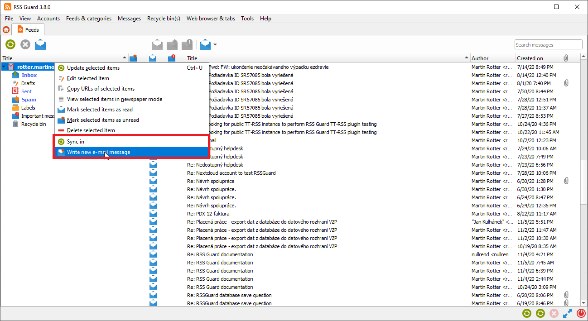
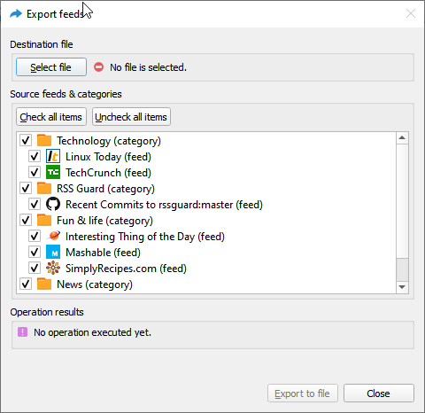

# Supported feed formats and online feed services
RSS Guard is a modular application which supports plugins. It offers well-maintained and relatively stable [plugin API](https://github.com/martinrotter/rssguard/blob/master/src/librssguard/services/abstract/serviceentrypoint.h) which can be used to add support for various online feed services, extend a way feeds are processed or add totally new functionality to RSS Guard. At this point RSS Guard offers these plugins which are bundled in all installation packages and some of their features are described in detail in this documentation:
* Standard `RSS/RDF/ATOM/JSON` plugin: This is the core plugin of RSS Guard which allows you to user the app like normal standalone feed reader with great features everyone would expect, including `OPML` files export and import or feed metadata fetching. Also podcasts are supported.
* [Tiny Tiny RSS](https://tt-rss.org) plugin: Adds ability to synchronize messages with TT-RSS instances, either self-hosted or via 3rd-party external service.
* [Inoreader](https://www.inoreader.com) plugin: Adds ability to synchronize messages with Inoreader. All you need to do is create free account on their website and start rocking.
* [Nextcloud News](https://apps.nextcloud.com/apps/news) plugin: Nextcloud News is a Nextcloud app which adds feed reader abilities into your Nextcloud instances.
* [Google Reader API](https://rss-sync.github.io/Open-Reader-API/resources/#unofficial-google-reader-documentation) plugin: This plugin was added in RSS Guard 3.9.0 and offers two-way synchronization with services which implement Google Reader API. At this point, plugin was tested and works with Bazqux, The Old Reader and FreshRSS.
* [Feedly](https://feedly.com) plugin: Provides synchronization with Feedly and supports both official productions keys mode as well as `developer access token` mode.
* [Gmail](https://www.google.com/gmail) plugin: Yes, you are reading it right. RSS Guard can be used as very lightweight and simple e-mail client. This plugins uses [Gmail API](https://developers.google.com/gmail/api) and offers even e-mail sending.

> All plugins share almost all core RSS Guard's features, including labels, recycle bins, podcasts fetching or newspaper view. They are implemented in a very transparent way, making it easy to maintain them or add new ones.

Usually, plugins have some exclusive functionality, for example Gmail plugin allows user to send e-mail messages or reply to existing ones. This extra functionality is always accessible via plugin's context menu and also via main menu.

If there is interest in other plugins, you might write one yourself or if many people are interested then I might write it for you, even commercially if we make proper arrangements.

## Plugin API
RSS Guard offers simple `C++` API for creating new service plugins. All base API classes are in folder [`abstract`](https://github.com/martinrotter/rssguard/tree/master/src/librssguard/services/abstract). User must subclass and implement all interface classes:

| Class | Purpose |
|-------|---------|
| `ServiceEntryPoint` | Very base class which provides basic information about the plugin name, author etc. It also provides methods which are called when new account should be created and when existing accounts should be loaded from database. |
| `ServiceRoot` | This is the core "account" class which represents account node in feed's list and offers interface for all critical functionality of a plugin, including handlers which are called when starting/stoping a plugin, marking messages read/unread/starred/deleted, (de)assigning labels etc. |

API is reasonably simple to understand but relatively large. Sane default behavior is employed where it makes sense.

Perhaps the best approach to use when writing new plugin is to copy [existing](https://github.com/martinrotter/rssguard/tree/master/src/librssguard/services/greader) one and start from there.

Note that RSS Guard can support loading of plugins from external libraries (dll, so, etc.) but the functionality must be polished because so far all plugins are directly bundled into the app as no one really requested run-time loading of plugins so far.

## Features found exclusively in `standard RSS` plugin
Standard plugin in RSS Guard offers some features which are specific to it. Of course it supports all news syndication formats which are nowadays used:
* RSS 0.90, 0.91, 0.92, 1.0 (also known as *RDF*), 2.0.
* ATOM 1.0,
* [JSON](https://www.jsonfeed.org).

Standard plugin offers some extra features like export/import of OPML 2.0 files or fetching feed metadata.

OPML files can be exported/imported in simple dialog.

You just select output file (in case of OPML export), check desired feeds and hit `Export to file`.

### Websites scraping and related advanced features

> **Only proceed if you consider yourself to be a power user and you know what you are doing!**

RSS Guard 3.9.0+ offers extra advanced features which are inspired by [Liferea](https://lzone.de/liferea/).

You can select source type of each feed. If you select `URL`, then RSS Guard simply downloads feed file from given location and behave like everyone would expect.

However, if you choose `Script` option, then you cannot provide URL of your feed and you rely on custom script to generate feed file and provide its contents to **standard output**. Resulting data written to standard output should be valid feed file, for example RSS or ATOM XML file.

`Fetch it now` button also works with `Script` option. Therefore, if your source script and (optional) post-process script in cooperation deliver a valid feed file to the output, then all important metadata, like title or icon of the feed, can be automagically discovered.

Any errors in your script must be written to **error output**.

Note that you must provide full execution line to your custom script, including interpreter binary path and name and all that must be written in special format `<interpreter>#<argument1>#<argument2>#....`. The `#` character is there to separate interpreter and individual arguments.

Interpreter must be provided in all cases, arguments do not have to be. For example `bash.exe#` is valid execution line, as well as `bash#-c#cat feed.atom`. Note the difference in interpreter's binary name suffix. Also be very carefuly about arguments quoting. Some examples of valid and tested execution lines are:
 
| Command | Explanation |
|---------|-------------|
| `bash#-c#curl https://github.com/martinrotter.atom` | Downloads ATOM feed file with Bash and Curl. |
| `Powershell#Invoke-WebRequest 'https://github.com/martinrotter.atom' \| Select-Object -ExpandProperty Content` | Downloads ATOM feed file with Powershell. |
| `php#tweeper.php#-v#0#https://twitter.com/NSACareers` | Scrape Twitter RSS feed file with [Tweeper](https://git.ao2.it/tweeper.git). Tweeper is utility which is able to produce RSS feed from Twitter and other similar social platforms. |

Note that the above examples are cross-platform and you can use the exact same command on Windows, Linux or Mac OS X, if your operating system is properly configured.

RSS Guard offers placeholder `%data%` which is automatically replaced with full path to RSS Guard's [user data folder](Documentation.md#portable-user-data). You can, therefore, use something like this as source script line: `bash#%data%/scripts/download-feed.sh`.

Also, working directory of process executing the script is set to RSS Guard's user data folder.

There are some examples of website scrapers [here](https://github.com/martinrotter/rssguard/tree/master/resources/scripts/scrapers), most of the are written in Python 3, thus their execution line is `python.exe#script.py`.

After your source feed data are downloaded either via URL or custom script, you can optionally post-process the data with one more custom script, which will take **raw source data as input** and must produce processed valid feed data to **standard output** while printing all error messages to **error output**.

Format of post-process script execution line is the same as above.

Typical post-processing filter might do things like advanced CSS formatting of feed file entries, removing some ads or simply pretty-printing XML data:

| Command | Explanation |
|---------|-------------|
| `bash#-c#xmllint --format -` | Pretty-print input XML feed data. |